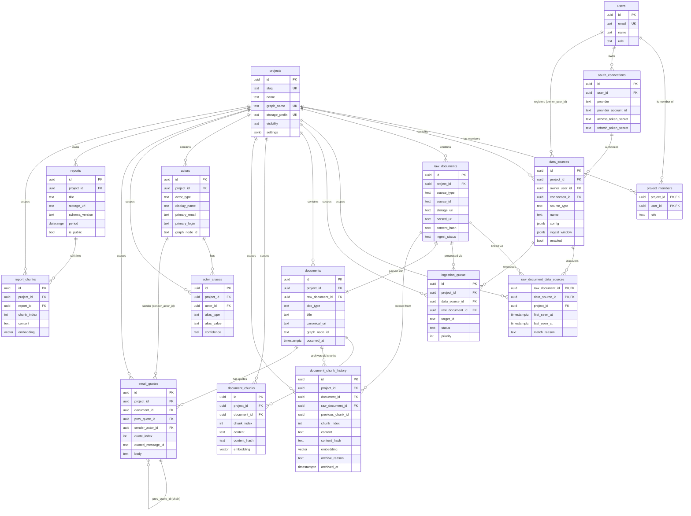

# プロジェクトエディターエージェント - Pufu Lens - システムデザイン

## データモデル

### 1. マルチプロジェクト方針

- **`projects` テーブル**で論理プロジェクトを定義する。`slug` でストレージプレフィックスや AGE グラフ名を組み立てる。
- `slug` は local storage prefix と同じ validation を使い、2 文字以上、英小文字・数字・中間の hyphen のみを許可する。1 文字 slug は storage prefix 初期化との不整合を避けるため許可しない。
- ほぼ全てのテーブルに `project_id` カラムを持たせ、`(project_id, …)` のユニーク制約・インデックスで分離する。
- ナレッジグラフは **プロジェクトごとに専用の AGE グラフ**（`graph_<project_slug>` 例: `graph_project_a`）を作成する。Cypher クエリは現在の `project_id` をもとにグラフ名を解決する。
- AGE graph name は slug の hyphen を underscore に置き換え、`graph_` prefix を付けて生成する。PostgreSQL identifier truncation による idempotency 破壊を避けるため、生成後の `graph_name` は 63 文字以下に制限する。
- オブジェクトストレージは **プロジェクトごとに専用プレフィックス**（`<project_slug>/raw/...`, `<project_slug>/parsed/...`, `<project_slug>/reports/...`）で分離する。
- 取り込み時の安全のため、Mastra のツール / ワークフローはすべて `project_id` 必須引数を持ち、テナント越境クエリを禁止する。
- データベース運用そのものは単一の PostgreSQL クラスタを使い、プロジェクト分離は **スキーマ / グラフ / プレフィックスのレイヤ** で実現する。物理的に DB を分けたいケース（規制要件・大型プロジェクト）に備え、後述のように `DATABASE_URL` をプロジェクト単位で切り替える運用パスも残す。

### 2. PostgreSQL スキーマ

```sql
-- 拡張機能
CREATE EXTENSION IF NOT EXISTS pgcrypto;
CREATE EXTENSION IF NOT EXISTS vector;
CREATE EXTENSION IF NOT EXISTS age;
LOAD 'age';
SET search_path = ag_catalog, "$user", public;

-- Web ログインユーザー
CREATE TABLE users (
  id         UUID PRIMARY KEY DEFAULT gen_random_uuid(),
  email      TEXT NOT NULL UNIQUE,
  name       TEXT,
  role       TEXT NOT NULL DEFAULT 'member' CHECK (role IN ('admin', 'member')),
  created_at TIMESTAMPTZ DEFAULT now()
);

-- アプリログイン用 provider account 対応
-- provider token / refresh token は保存せず、Auth.js JWT session から users.id を解決するための
-- 安定した対応表だけを保持する。既存 email への自動 link は provider 側の検証済み email を必須にする。
CREATE TABLE auth_accounts (
  provider            TEXT NOT NULL CHECK (provider IN ('google', 'github')),
  provider_account_id TEXT NOT NULL,
  user_id             UUID NOT NULL REFERENCES users(id) ON DELETE CASCADE,
  email               TEXT NOT NULL,
  email_verified      BOOLEAN NOT NULL DEFAULT false,
  created_at          TIMESTAMPTZ DEFAULT now(),
  updated_at          TIMESTAMPTZ DEFAULT now(),
  PRIMARY KEY (provider, provider_account_id),
  UNIQUE (provider, user_id)
);

-- OAuth を使わない環境向けの Credentials provider 用 password hash。
-- password の実値は保存せず、アプリログイン用途だけに使う。
CREATE TABLE auth_password_credentials (
  user_id       UUID PRIMARY KEY REFERENCES users(id) ON DELETE CASCADE,
  password_hash TEXT NOT NULL,
  created_at    TIMESTAMPTZ DEFAULT now(),
  updated_at    TIMESTAMPTZ DEFAULT now()
);

-- プロジェクト（論理テナント）
CREATE TABLE projects (
  id              UUID PRIMARY KEY DEFAULT gen_random_uuid(),
  slug            TEXT NOT NULL UNIQUE,        -- 'project-a' 等。グラフ名 / ストレージプレフィックスに利用
  name            TEXT NOT NULL,
  description     TEXT,
  graph_name      TEXT NOT NULL UNIQUE,        -- 'graph_project_a'
  storage_prefix  TEXT NOT NULL UNIQUE,        -- 'project-a'
  visibility      TEXT NOT NULL DEFAULT 'private' CHECK (visibility IN ('private', 'public')),
  settings        JSONB NOT NULL DEFAULT '{}', -- LLM、embedding モデル等
  created_at      TIMESTAMPTZ DEFAULT now(),
  updated_at      TIMESTAMPTZ DEFAULT now()
);

-- プロジェクト × ユーザー（権限）
CREATE TABLE project_members (
  project_id   UUID NOT NULL REFERENCES projects(id) ON DELETE CASCADE,
  user_id      UUID NOT NULL REFERENCES users(id) ON DELETE CASCADE,
  role         TEXT NOT NULL DEFAULT 'member', -- admin | member
  created_at   TIMESTAMPTZ DEFAULT now(),
  PRIMARY KEY (project_id, user_id)
);

-- Google / GitHub 連携（プロジェクト単位）
CREATE TABLE oauth_connections (
  id              UUID PRIMARY KEY DEFAULT gen_random_uuid(),
  project_id      UUID NOT NULL REFERENCES projects(id) ON DELETE CASCADE,
  user_id         UUID NOT NULL REFERENCES users(id) ON DELETE CASCADE,
  provider        TEXT NOT NULL, -- 'google' | 'github'
  provider_account_id TEXT NOT NULL DEFAULT '',
  account_email   TEXT,
  account_login   TEXT,
  scopes          TEXT[] NOT NULL DEFAULT '{}',
  metadata        JSONB NOT NULL DEFAULT '{}',
  access_token_secret  TEXT,
  refresh_token_secret TEXT,
  expires_at      TIMESTAMPTZ,
  created_at      TIMESTAMPTZ NOT NULL DEFAULT now(),
  updated_at      TIMESTAMPTZ NOT NULL DEFAULT now(),
  UNIQUE (project_id, provider),
  UNIQUE (id, user_id)
);

-- プロジェクトに紐づくデータソース
CREATE TABLE data_sources (
  id              UUID PRIMARY KEY DEFAULT gen_random_uuid(),
  project_id      UUID NOT NULL REFERENCES projects(id) ON DELETE CASCADE,
  owner_user_id   UUID NOT NULL REFERENCES users(id),
  connection_id   UUID REFERENCES oauth_connections(id),
  source_type     TEXT NOT NULL, -- 'gmail' | 'drive' | 'github' | 'web'
  name            TEXT NOT NULL,
  config          JSONB NOT NULL,
  ingest_window   JSONB DEFAULT '{}',
  enabled         BOOLEAN DEFAULT true,
  last_checked_at TIMESTAMPTZ,
  created_at      TIMESTAMPTZ DEFAULT now(),
  updated_at      TIMESTAMPTZ DEFAULT now(),
  UNIQUE (project_id, source_type, name),
  FOREIGN KEY (connection_id, owner_user_id)
    REFERENCES oauth_connections(id, user_id)
);
CREATE INDEX ON data_sources (project_id, enabled);

-- 元データ（オブジェクトストレージに原本を保存し、メタデータ・取り込み状況を DB 管理）
-- 「同じ実体」を複数の data_source が拾うケースを表現するため、
-- raw_documents は data_source への直接 FK を持たず、raw_document_data_sources で n:m に紐づける。
CREATE TABLE raw_documents (
  id              UUID PRIMARY KEY DEFAULT gen_random_uuid(),
  project_id      UUID NOT NULL REFERENCES projects(id) ON DELETE CASCADE,
  source_type     TEXT NOT NULL,        -- 'gmail' | 'drive' | 'github' | 'web'
  source_id       TEXT NOT NULL,        -- 外部 ID（メール ID 等）
  source_uri      TEXT,                 -- 取得元 URI（gmail://..., https://...）
  storage_uri     TEXT NOT NULL,        -- 原本の Object Storage URI（後述）
  parsed_uri      TEXT,                 -- 解析済み JSON の Object Storage URI（任意）
  parser_profile_id UUID,               -- parse に使う parser profile（承認待ち時の要求先。FK は後述）
  parser_version_id UUID,               -- parse に使った parser version（FK は後述）
  parser_artifact_hash TEXT,            -- parse 実行時に検証した artifact hash
  mime_type       TEXT,
  byte_size       BIGINT,
  content_hash    TEXT NOT NULL,        -- 更新検知 / SAME_AS 候補抽出用
  fetched_at      TIMESTAMPTZ NOT NULL DEFAULT now(),
  parsed_at       TIMESTAMPTZ,
  indexed_at      TIMESTAMPTZ,
  ingest_status   TEXT NOT NULL DEFAULT 'fetched' CHECK (ingest_status IN ('fetched', 'held', 'parsed', 'indexed', 'failed')), -- fetched | held | parsed | indexed | failed
  ingest_error    TEXT,
  hold_reason     TEXT,                 -- parser_approval_required | parser_contract_mismatch 等
  metadata        JSONB NOT NULL DEFAULT '{}',
  created_at      TIMESTAMPTZ DEFAULT now(),
  updated_at      TIMESTAMPTZ DEFAULT now(),
  -- 外部システム上の同一ドキュメントは 1 行に統合
  UNIQUE (project_id, source_type, source_id)
);
CREATE INDEX ON raw_documents (project_id, ingest_status, fetched_at DESC);
-- content_hash は更新検知と SAME_AS 候補抽出に使う。同一本文でも別エンティティとして扱う
-- source があるため、DB の UNIQUE にはしない。
CREATE INDEX ON raw_documents (project_id, source_type, content_hash);

-- Ingestion 実行キュー
-- Collection Pipeline が原本保存（raw_documents 作成）後に投入する。
-- そのため raw_document_id は必須参照とし、target_id / target_uri は
-- 外部システム上の識別子（dedup・監査用の補助情報）として保持する。
CREATE TABLE ingestion_queue (
  id              UUID PRIMARY KEY DEFAULT gen_random_uuid(),
  project_id      UUID NOT NULL REFERENCES projects(id) ON DELETE CASCADE,
  data_source_id  UUID NOT NULL REFERENCES data_sources(id) ON DELETE CASCADE,
  raw_document_id UUID NOT NULL REFERENCES raw_documents(id) ON DELETE CASCADE,
  target_id       TEXT NOT NULL,      -- 外部システム上の ID（メール ID、ファイル ID、Issue URL 等）
  target_uri      TEXT,
  priority        INTEGER DEFAULT 0,
  status          TEXT NOT NULL DEFAULT 'pending' CHECK (status IN ('pending', 'held', 'parsing', 'parsed', 'indexed', 'failed', 'skipped')), -- pending | held | parsing | parsed | indexed | failed | skipped
  reason          TEXT,
  hold_reason     TEXT,                 -- parser_approval_required | parser_contract_mismatch 等
  parser_profile_id UUID,               -- 承認待ち時の要求先、または解決された parser profile（FK は後述）
  parser_version_id UUID,               -- retry 時に固定した parser version（FK は後述）
  attempts        INTEGER NOT NULL DEFAULT 0,
  last_error      TEXT,
  lease_expires_at TIMESTAMPTZ,          -- parsing worker の lease 期限。期限切れは再取得可能
  scheduled_at    TIMESTAMPTZ DEFAULT now(),
  created_at      TIMESTAMPTZ DEFAULT now(),
  updated_at      TIMESTAMPTZ DEFAULT now(),
  UNIQUE (project_id, raw_document_id),
  UNIQUE (project_id, data_source_id, target_id)
);
CREATE INDEX ON ingestion_queue (project_id, status, priority DESC, scheduled_at);
CREATE INDEX ON ingestion_queue (project_id, status, lease_expires_at) WHERE status = 'parsing';

-- 既存 init.sql から更新する場合は、held status を許可するため CHECK 制約を再作成する。
ALTER TABLE raw_documents
  DROP CONSTRAINT raw_documents_ingest_status_check,
  ADD CONSTRAINT raw_documents_ingest_status_check CHECK (ingest_status IN ('fetched', 'held', 'parsed', 'indexed', 'failed'));

ALTER TABLE ingestion_queue
  DROP CONSTRAINT ingestion_queue_status_check,
  ADD CONSTRAINT ingestion_queue_status_check CHECK (status IN ('pending', 'held', 'parsing', 'parsed', 'indexed', 'failed', 'skipped'));

-- Parser Registry
-- project / data_source / source_type ごとの parser 選択と、version 承認履歴を管理する。
-- parser artifact は Object Storage に immutable に保存し、DB には URI と hash だけを保持する。
ALTER TABLE data_sources
  ADD CONSTRAINT data_sources_project_id_id_key UNIQUE (project_id, id);

CREATE TABLE parser_profiles (
  id              UUID PRIMARY KEY DEFAULT gen_random_uuid(),
  project_id      UUID NOT NULL REFERENCES projects(id) ON DELETE CASCADE,
  data_source_id  UUID,
  source_type     TEXT NOT NULL CHECK (source_type IN ('gmail', 'drive', 'github', 'web')),
  name            TEXT NOT NULL,
  parser_kind     TEXT NOT NULL DEFAULT 'built_in_config' CHECK (parser_kind IN ('built_in_config', 'declarative_bundle')), -- built_in_config | declarative_bundle
  active_version_id UUID,
  enabled         BOOLEAN NOT NULL DEFAULT true,
  created_at      TIMESTAMPTZ DEFAULT now(),
  updated_at      TIMESTAMPTZ DEFAULT now(),
  UNIQUE (project_id, id),
  UNIQUE (project_id, data_source_id, source_type, name),
  FOREIGN KEY (project_id, data_source_id)
    REFERENCES data_sources(project_id, id) ON DELETE CASCADE
);
CREATE INDEX ON parser_profiles (project_id, source_type, enabled);
CREATE UNIQUE INDEX parser_profiles_project_source_type_name_null_idx
  ON parser_profiles (project_id, source_type, name)
  WHERE data_source_id IS NULL;

CREATE TABLE parser_versions (
  id                    UUID PRIMARY KEY DEFAULT gen_random_uuid(),
  parser_profile_id      UUID NOT NULL REFERENCES parser_profiles(id) ON DELETE CASCADE,
  version               TEXT NOT NULL,
  schema_version         TEXT NOT NULL,
  artifact_uri           TEXT NOT NULL,
  artifact_hash          TEXT NOT NULL,
  validation_report_uri  TEXT,
  status                 TEXT NOT NULL DEFAULT 'draft' CHECK (status IN ('draft', 'review_requested', 'approved', 'rejected', 'retired')), -- draft | review_requested | approved | rejected | retired
  created_by_user_id     UUID REFERENCES users(id),
  approved_by_user_id    UUID REFERENCES users(id),
  approved_at            TIMESTAMPTZ,
  rejection_reason       TEXT,
  created_at             TIMESTAMPTZ DEFAULT now(),
  updated_at             TIMESTAMPTZ DEFAULT now(),
  UNIQUE (parser_profile_id, version),
  UNIQUE (parser_profile_id, artifact_hash)
);
CREATE INDEX ON parser_versions (parser_profile_id, status, created_at DESC);

ALTER TABLE parser_versions
  ADD CONSTRAINT parser_versions_profile_id_id_key UNIQUE (parser_profile_id, id);

ALTER TABLE parser_profiles
  ADD CONSTRAINT parser_profiles_active_version_fk
  FOREIGN KEY (id, active_version_id) REFERENCES parser_versions(parser_profile_id, id) ON DELETE SET NULL (active_version_id);

ALTER TABLE raw_documents
  ADD CONSTRAINT raw_documents_parser_profile_fk
  FOREIGN KEY (project_id, parser_profile_id) REFERENCES parser_profiles(project_id, id) ON DELETE SET NULL (parser_profile_id),
  ADD CONSTRAINT raw_documents_parser_version_fk
  FOREIGN KEY (parser_profile_id, parser_version_id) REFERENCES parser_versions(parser_profile_id, id) ON DELETE SET NULL (parser_version_id);

ALTER TABLE ingestion_queue
  ADD CONSTRAINT ingestion_queue_parser_profile_fk
  FOREIGN KEY (project_id, parser_profile_id) REFERENCES parser_profiles(project_id, id) ON DELETE SET NULL (parser_profile_id),
  ADD CONSTRAINT ingestion_queue_parser_version_fk
  FOREIGN KEY (parser_profile_id, parser_version_id) REFERENCES parser_versions(parser_profile_id, id) ON DELETE SET NULL (parser_version_id);

-- どの data_source 経由で取り込まれたかの履歴（n:m）。
-- 同じメールが複数のラベル data_source にマッチしたケース等を保持する。
CREATE TABLE raw_document_data_sources (
  raw_document_id UUID NOT NULL REFERENCES raw_documents(id) ON DELETE CASCADE,
  data_source_id  UUID NOT NULL REFERENCES data_sources(id) ON DELETE CASCADE,
  project_id      UUID NOT NULL REFERENCES projects(id) ON DELETE CASCADE,
  first_seen_at   TIMESTAMPTZ NOT NULL DEFAULT now(),
  last_seen_at    TIMESTAMPTZ NOT NULL DEFAULT now(),
  match_reason    TEXT,                 -- どの条件でマッチしたか（ラベル名、クエリ等）
  metadata        JSONB NOT NULL DEFAULT '{}',
  PRIMARY KEY (raw_document_id, data_source_id)
);
CREATE INDEX ON raw_document_data_sources (project_id, data_source_id);
CREATE INDEX ON raw_document_data_sources (project_id, raw_document_id);

-- ナレッジグラフのノードに対応するアプリ層メタテーブル（1 ドキュメント = 1 ノード）
CREATE TABLE documents (
  id              UUID PRIMARY KEY DEFAULT gen_random_uuid(),
  project_id      UUID NOT NULL REFERENCES projects(id) ON DELETE CASCADE,
  raw_document_id UUID NOT NULL REFERENCES raw_documents(id) ON DELETE CASCADE,
  doc_type        TEXT NOT NULL,        -- 'email' | 'drive_doc' | 'issue' | 'pull_request' | 'web_page'
  title           TEXT,
  summary         TEXT,
  canonical_uri   TEXT,                 -- 公開可能な URI（メールスレッド、Issue URL 等）
  occurred_at     TIMESTAMPTZ,          -- 送信日時、PR 作成/マージ日時、ページ更新時刻等
  graph_node_id   TEXT NOT NULL,        -- AGE 上のノード識別子（graph 内で MERGE するキー）
  metadata        JSONB NOT NULL DEFAULT '{}',
  created_at      TIMESTAMPTZ DEFAULT now(),
  updated_at      TIMESTAMPTZ DEFAULT now(),
  UNIQUE (raw_document_id),
  UNIQUE (project_id, doc_type, graph_node_id)
);
CREATE INDEX ON documents (project_id, doc_type, occurred_at DESC);

-- ベクトル検索用チャンク（1 ドキュメント : N チャンク。N=1 もあり得る）
CREATE TABLE document_chunks (
  id              UUID PRIMARY KEY DEFAULT gen_random_uuid(),
  project_id      UUID NOT NULL REFERENCES projects(id) ON DELETE CASCADE,
  document_id     UUID NOT NULL REFERENCES documents(id) ON DELETE CASCADE,
  chunk_index     INTEGER NOT NULL,
  content         TEXT NOT NULL,
  content_hash    TEXT NOT NULL,
  embedding       vector(1536),
  embedding_model TEXT NOT NULL DEFAULT 'gemini-embedding-2',
  metadata        JSONB NOT NULL DEFAULT '{}',
  created_at      TIMESTAMPTZ DEFAULT now(),
  UNIQUE (project_id, document_id, chunk_index),
  UNIQUE (project_id, document_id, content_hash)
);
CREATE INDEX ON document_chunks USING hnsw (embedding vector_cosine_ops);
CREATE INDEX ON document_chunks (project_id, document_id);

-- チャンク更新履歴
-- document_chunks は検索対象の最新版だけを保持する。更新検知で再チャンク化する場合は、
-- 削除前の旧チャンクをこのテーブルへ退避してから document_chunks を削除し、新しいチャンクを挿入する。
CREATE TABLE document_chunk_history (
  id                         UUID PRIMARY KEY DEFAULT gen_random_uuid(),
  project_id                 UUID NOT NULL REFERENCES projects(id) ON DELETE CASCADE,
  document_id                UUID NOT NULL REFERENCES documents(id) ON DELETE CASCADE,
  raw_document_id            UUID NOT NULL REFERENCES raw_documents(id) ON DELETE CASCADE,
  previous_chunk_id          UUID NOT NULL,
  chunk_index                INTEGER NOT NULL,
  content                    TEXT NOT NULL,
  content_hash               TEXT NOT NULL,
  embedding                  vector(1536),
  embedding_model            TEXT NOT NULL,
  metadata                   JSONB NOT NULL DEFAULT '{}',
  archived_at                TIMESTAMPTZ NOT NULL DEFAULT now(),
  archive_reason             TEXT NOT NULL DEFAULT 'document_updated', -- document_updated | parser_changed | embedding_model_changed | chunk_config_changed | manual_reindex
  superseded_by_raw_document_id UUID REFERENCES raw_documents(id),
  superseded_by_content_hash TEXT
);
CREATE INDEX ON document_chunk_history (project_id, document_id, archived_at DESC);
CREATE INDEX ON document_chunk_history (project_id, raw_document_id);

-- Actor（人物・組織。メール送信者・PR 作成者・PR レビュアー等を一意に表現）
CREATE TABLE actors (
  id              UUID PRIMARY KEY DEFAULT gen_random_uuid(),
  project_id      UUID NOT NULL REFERENCES projects(id) ON DELETE CASCADE,
  actor_type      TEXT NOT NULL DEFAULT 'person', -- 'person' | 'organization' | 'bot'
  display_name    TEXT NOT NULL,
  primary_email   TEXT,
  primary_login   TEXT,                 -- GitHub login 等の代表識別子
  metadata        JSONB NOT NULL DEFAULT '{}',
  graph_node_id   TEXT NOT NULL,
  created_at      TIMESTAMPTZ DEFAULT now(),
  updated_at      TIMESTAMPTZ DEFAULT now(),
  UNIQUE (project_id, graph_node_id)
);
CREATE INDEX ON actors (project_id, actor_type);

-- 同一 Actor が持つ別名（メールアドレス、GitHub login、表示名、Slack ID 等）
CREATE TABLE actor_aliases (
  id           UUID PRIMARY KEY DEFAULT gen_random_uuid(),
  project_id   UUID NOT NULL REFERENCES projects(id) ON DELETE CASCADE,
  actor_id     UUID NOT NULL REFERENCES actors(id) ON DELETE CASCADE,
  alias_type   TEXT NOT NULL, -- 'email' | 'github_login' | 'display_name' | 'slack_id' | 'domain'
  alias_value  TEXT NOT NULL,
  confidence   REAL NOT NULL DEFAULT 1.0, -- 自動マージの確信度
  source       TEXT,                       -- どこから検出したか（gmail header 等）
  created_at   TIMESTAMPTZ DEFAULT now(),
  UNIQUE (project_id, alias_type, alias_value)
);
CREATE INDEX ON actor_aliases (project_id, actor_id);

-- メールの引用チェーン
-- 取り込みは「最新のメール」だけ。過去のメールは email_quotes として親メールにぶら下げる。
-- 同一スレッドのメール群は prev_message_id でリスト構造を成す。
CREATE TABLE email_quotes (
  id              UUID PRIMARY KEY DEFAULT gen_random_uuid(),
  project_id      UUID NOT NULL REFERENCES projects(id) ON DELETE CASCADE,
  document_id     UUID NOT NULL REFERENCES documents(id) ON DELETE CASCADE, -- 「最新メール」の Document
  quote_index     INTEGER NOT NULL,       -- 1, 2, ... が引用部。最新メール本文は documents 側に保持する
  quoted_message_id TEXT,                 -- RFC 822 Message-ID（判明する場合）
  prev_quote_id   UUID REFERENCES email_quotes(id), -- 引用チェーン上の 1 つ古い要素
  sender_alias    TEXT,                   -- 引用ヘッダから抽出した送信者表示
  sender_actor_id UUID REFERENCES actors(id), -- 名寄せ後の Actor
  sent_at         TIMESTAMPTZ,
  body            TEXT NOT NULL,
  metadata        JSONB NOT NULL DEFAULT '{}',
  created_at      TIMESTAMPTZ DEFAULT now(),
  UNIQUE (project_id, document_id, quote_index)
);
CREATE INDEX ON email_quotes (project_id, document_id, quote_index);

-- AGE グラフはプロジェクトごとに作成
-- 例: SELECT create_graph('graph_project_a');
-- プロジェクト作成時に create-project.ts が projects 行作成と同じトランザクション境界で作成する。
-- graph_name は slug から生成し、英小文字・数字・underscore のみ、かつ 63 文字以下を許可する。
-- slug は storage prefix と同じく 2 文字以上、英小文字・数字・中間の hyphen のみを許可する。

-- AGE を使う接続では、接続プールの接続確立時に毎回以下を実行する。
-- LOAD 'age';
-- SET search_path = ag_catalog, "$user", public;

-- レポートメタデータ（本体は Object Storage 上の JSON）
CREATE TABLE reports (
  id          UUID PRIMARY KEY DEFAULT gen_random_uuid(),
  project_id  UUID NOT NULL REFERENCES projects(id) ON DELETE CASCADE,
  title       TEXT NOT NULL,
  summary     TEXT,
  storage_uri TEXT NOT NULL,            -- 例: gs://bucket/project-a/reports/<id>.json
                                        --     file:///data/project-a/reports/<id>.json
  schema_version TEXT NOT NULL DEFAULT 'v1',
  period      DATERANGE,
  is_public   BOOLEAN DEFAULT false,
  generated_by TEXT,                    -- 実行ジョブ名 / コミット SHA 等
  created_at  TIMESTAMPTZ DEFAULT now()
);
CREATE INDEX ON reports (project_id, created_at DESC);

-- レポート検索用チャンク
CREATE TABLE report_chunks (
  id          UUID PRIMARY KEY DEFAULT gen_random_uuid(),
  project_id  UUID NOT NULL REFERENCES projects(id) ON DELETE CASCADE,
  report_id   UUID NOT NULL REFERENCES reports(id) ON DELETE CASCADE,
  chunk_index INTEGER NOT NULL,
  content     TEXT NOT NULL,
  embedding   vector(1536),             -- Gemini embedding は出力次元を 1536 に固定して保存
  metadata    JSONB DEFAULT '{}',
  created_at  TIMESTAMPTZ DEFAULT now(),
  UNIQUE (project_id, report_id, chunk_index)
);
CREATE INDEX ON report_chunks USING hnsw (embedding vector_cosine_ops);
```

ER 図（主要カラムのみ抜粋）：



補足：

- `project_id` はほぼ全テーブルが持ち、テナント分離のキーになる。
- `raw_documents` と `data_sources` は **n:m**（中間 `raw_document_data_sources`）。同じ実体が複数 data_source で見つかるケースを表現する（「複数データソース・重複データの扱い」参照）。
- `raw_documents` → `documents` は **1:1**（`UNIQUE (documents.raw_document_id)` 相当の運用）。ただしソースをまたぐ意味的同一は AGE グラフ上で `(Document)-[:SAME_AS]->(Document)` として表現するため、リレーショナル上は 1:1 を保つ。
- `document_chunks` は現在の検索対象だけを持つ。ドキュメント更新、parser 変更、手動 reindex でチャンクが変わる場合は、旧 `document_chunks` を `document_chunk_history` に退避してから削除し、新しいチャンクを挿入する。
- `email_quotes` は `prev_quote_id` で自己参照のリスト構造をとり、引用チェーンを表す。
- ナレッジグラフ（AGE）上のノード／エッジはこの図には含めない。`documents.graph_node_id` / `actors.graph_node_id` から AGE 側のノードに対応する。

### 3. データソース設定

`data_sources` は「プロジェクト内の収集対象の単位」を表す。同じプロジェクト内で Gmail の「顧客 A スレッド」と「障害通知ラベル」を別ソースとして登録し、それぞれ異なる期間・条件・優先度を持たせる。

| 種別     | 必要な連携       | `config` キー                  |
| -------- | ---------------- | ------------------------------ |
| `gmail`  | Google OAuth     | `labels`, `from` / `to` / `cc` |
| `drive`  | Google OAuth     | `folder_url` / `folder_id`     |
| `github` | GitHub App       | `repositories`                 |
| `web`    | 不要（公開 URL） | `urls`                         |

初期実装では `config` を上記キーに限定し、Gmail query・Drive の MIME フィルタ・GitHub の include/labels/states・Web のクロール深度などは段階的に追加する（[将来の拡張](15-future.md) 参照）。

設定例：

```json
// gmail
{
  "project_slug": "project-a",
  "source_type": "gmail",
  "name": "Project A customer threads",
  "config": {
    "labels": ["ProjectA"],
    "from": ["customer@example.com"],
    "to": ["team@example.com"],
    "cc": []
  },
  "ingest_window": {
    "mode": "incremental",
    "initial_since": "2026-01-01",
    "lookback_days": 30
  }
}
```

```json
// drive
{
  "project_slug": "project-a",
  "source_type": "drive",
  "name": "Project A specs folder",
  "config": {
    "folder_url": "https://drive.google.com/drive/folders/XXXXXXXX"
    // または "folder_id": "XXXXXXXX"
  },
  "ingest_window": {
    "mode": "incremental",
    "initial_since": "2026-01-01"
  }
}
```

```json
// github
{
  "project_slug": "project-a",
  "source_type": "github",
  "name": "pufu-lens repo",
  "config": {
    "repositories": ["dyson-yamashita/pufu-lens"]
  },
  "ingest_window": {
    "mode": "incremental",
    "lookback_days": 14
  }
}
```

```json
// web
{
  "project_slug": "project-a",
  "source_type": "web",
  "name": "Product docs",
  "config": {
    "urls": ["https://example.com/docs", "https://example.com/changelog"]
  },
  "ingest_window": {
    "mode": "recrawl"
  }
}
```

`web` は `connection_id` を持たない公開 URL のデータソースとして登録できる。

`gmail` / `drive` / `github` のように OAuth / GitHub App 連携を使う data_source では、`connection_id` は対象 project に属し、かつ `owner_user_id` が所有する `oauth_connections` のみ参照できる。DB では `oauth_connections.project_id` と `UNIQUE (project_id, provider)` で project 単位の共有 connection を一意にし、`FOREIGN KEY (connection_id, owner_user_id) REFERENCES oauth_connections(id, user_id)` で最低限の所有者整合を保証する。作成 API ではさらに以下を検証する。

- `owner_user_id` が対象 `project_id` の `project_members` に存在すること。
- `connection_id` が対象 `project_id` に属すること。
- data_source の `source_type` と `oauth_connections.provider` が対応すること（`gmail` / `drive` は `google`、`github` は `github`）。
- `oauth_connections.scopes` が対象 source_type の読み取りに必要な scope を満たすこと。
- `web` data_source では `connection_id` を `NULL` にすること。

#### 3.1. `ingest_window` — 取り込み期間・頻度の制御

`config` が「**何を**」拾うかを定義するのに対し、`ingest_window` は「**いつから／どこまで遡って／どの頻度で**」拾うかを Collection Pipeline に指示するメタ設定。`data_sources.ingest_window` (JSONB) に保存する。

**フィールド一覧**：

| キー            | 型                                         | 必須 | 意味                                                                          |
| --------------- | ------------------------------------------ | ---- | ----------------------------------------------------------------------------- |
| `mode`          | `"incremental" \| "backfill" \| "recrawl"` | 必須 | 後述のモード                                                                  |
| `initial_since` | ISO 8601 文字列                            | 任意 | 初回 backfill / incremental の最古日。これより古いデータは対象外              |
| `lookback_days` | 整数                                       | 任意 | `incremental` で毎回 `last_checked_at` から N 日遡って再確認する保険的 window |
| `until`         | ISO 8601 文字列                            | 任意 | この日以降は取り込まない（期限付き取り込み用）                                |

**モードの挙動**：

| mode          | 列挙範囲                                               | 想定用途                                      |
| ------------- | ------------------------------------------------------ | --------------------------------------------- |
| `incremental` | `last_checked_at - lookback_days` 以降                 | Gmail / GitHub Issue・PR / Drive の通常運用   |
| `backfill`    | `initial_since` 以降を全件（時間制限なし）             | 初回セットアップ・過去データの一括取り込み    |
| `recrawl`     | 登録された URL / フォルダ / リポジトリを毎回全件再走査 | Web ページ等、同じ URL で内容が更新される対象 |

**スキップ・更新検知ポリシー**（モード共通）：

- 列挙された候補は **「複数データソース・重複データの扱い」の重複判定**（`(project_id, source_type, source_id)` の既存検索）が必ず走る。`raw_documents.ingest_status = 'indexed'` の既存ヒットは原則スキップ。
- 既存ヒットでも次の条件で再処理する：
  - `ingest_status = 'failed'` の場合は再キュー投入。
  - `recrawl` または `incremental` で `updatedAt` / `revisionId` / `content_hash` の変化を検知した場合は、`raw_documents` を更新（同じ ID で `parsed_uri` を再生成）→ 再 parse → 再 index。
- 再 index では、旧 `document_chunks` を同一 transaction 内で `document_chunk_history` に退避し、旧チャンクを `document_chunks` から削除してから新しいチャンクを挿入する。これにより通常検索は最新版だけを対象にしつつ、過去チャンクは監査・差分確認・再現性確認に使える。
- モードは「列挙範囲」の制御。重複判定と更新検知は全モードに共通して適用される。

**頻度制御**：

- `incremental` / `backfill`: Cloud Scheduler の `curate-hourly` 等が起動するたびに `last_checked_at` 以降を判定して取り込む（[定期実行（Cloud Scheduler）](09-scheduler.md) 参照）。
- `recrawl`: 専用の頻度設定は持たず、Cloud Scheduler の cron 設定（例: 1 時間ごと / 6 時間ごと）で起動間隔を制御する。`recrawl` data_source は起動のたびに登録対象を全件再走査し、`content_hash` 差分があったものだけ再 indexing する。

```jsonc
// incremental の例
{ "mode": "incremental", "initial_since": "2026-01-01", "lookback_days": 30 }

// backfill の例（過去全件、initial_since 以降）
{ "mode": "backfill", "initial_since": "2024-01-01" }

// recrawl の例（Web ページ向け）
{ "mode": "recrawl" }
```

### 4. ナレッジグラフ構造

「**1 ドキュメント = 1 グラフノード**」を基本ルールにする。ベクトル検索用のチャンクは別テーブル `document_chunks` に格納し、`document_id` で親ドキュメント＝グラフノードへ追跡できるようにする。1 つの Document に対し N 個のチャンクが紐づく（N=1 もあり得る）。

```
(Actor)-[:SENT]->(Document)-[:MENTIONS]->(Topic)   // parsed topic の keyword/concept target
(Document)-[:REPLY_TO]->(Topic)                    // parsed relation の message target
(Issue)-[:LINKED_TO]->(PullRequest)
(Actor)-[:AUTHORED]->(PullRequest)-[:CLOSES]->(Issue)
(Actor)-[:OWNS]->(DriveDoc)-[:REFERENCES]->(Issue)
(Document)-[:SAME_AS]->(Document)                  // ソースをまたぐ意味的同一
                                                    // 例: 同じ仕様書の DriveDoc と WebPage
(Document)-[:HAS_CHUNK]->(Chunk?)                  // チャンクはアプリ層 (document_chunks) で 1:N 管理
                                                    // グラフ側にチャンクノードは作らず、
                                                    // 必要に応じて HAS_CHUNK を仮想的に表現する
```

主要ノードラベル：

- Step 8 の実装では AGE 互換性を優先し、実際の primary label は `Document` / `Actor` / `Topic` に寄せる。
- `Email` / `Issue` / `PullRequest` / `DriveDoc` / `WebPage` などの詳細種別は `graphLabels` property と `documents.doc_type` に保持する。
- `Actor` — 人物・組織・Bot（メール送信者、PR 作成者、PR レビュアー等）。`actors.id` と 1:1。
- `Topic` — 文書から抽出した意味キーワード / 概念。Web ページは `TopicExtractionAgent` が生成した parsed `topics`（`topicType: "keyword"`）から `topic:keyword:<encoded lowercase target>` として作成し、`(Document)-[:MENTIONS]->(Topic)` で接続する。`target` property には元の表記を保持する。URL リンクは Topic ノードにしない。メールの `REPLY_TO` relation は `topic:message:<encoded target>` として `(Document)-[:REPLY_TO]->(Topic {topicType: "message"})` を作成する。

#### 4.1. Actor と名寄せ

- `actors` は **プロジェクト内で一意な人物・組織を表現** する。
- 1 つの Actor は `actor_aliases` で複数の識別子（メール、GitHub login、表示名、Slack ID 等）を持てる。
- 取り込み時のリゾルバはおおむね次の順で名寄せを試みる。
  1. 完全一致のエイリアスがある → 既存 Actor を使う。
  2. 同じドメインの会社メール + GitHub login の組み合わせ等の弱いシグナル → 確信度を計算し、しきい値以上なら自動マージ。
  3. しきい値未満 → 新規 Actor を作成し、`actor_aliases` に「未マージ候補」フラグを付ける。

- マージ結果は `actor_aliases.confidence` と `metadata.merge_history` に履歴を残し、管理 UI から手動修正できるようにする。
- Step 6 の初期実装では email / GitHub login を strong alias として `actor_aliases` に永続化し、display name は低 confidence の resolve output に留める。display name だけでは自動統合しない。
- Step 6 の初期実装では `actors.graph_node_id` は `actor:<alias_type>:<encoded alias>` または `actor:unresolved:<encoded sourceId>:<encoded occurrenceKey>:<encoded displayName>` の安定 ID として保存する。AGE グラフ構築時は `actors.id` と `graph_node_id` の両方を辿れるようにし、最終的な graph materialization 方針は Step 8 で確定する。

#### 4.2. メールの引用と取り込み単位

- スレッドの取り込みは **最新メール 1 通** だけを `documents` ＋ AGE ノードに登録する。
- 過去メール（引用部分）は同じ Document に紐づく `email_quotes` 行として保存する。最新メール本文は `documents` / parsed body 側に保持し、引用ブロックだけを `quote_index = 1, 2, ...` で保存する。
- `prev_quote_id` で 1 つ前の引用要素を指し、引用同士を **リスト構造**（1 つ前の発言 → … → 最古の発言）として辿れる。
- Step 8 の実装では、parsed relation の `REPLY_TO` は AGE 上で `(Document)-[:REPLY_TO]->(Topic {topicType: "message"})` として materialize する。`quoted_message_id` が判明する引用の Document 突き合わせと `(Document)-[:REPLY_TO]->(Document)` 化は未実装で、`email_quotes.prev_quote_id` による引用チェーン保存に留める。
- 引用ヘッダから検出される送信者は **`sender_alias` として保存し、Actor リゾルバ経由で `sender_actor_id` に正規化** する。これにより「最新メールの送信者だけでなく、引用に出てきた人」もグラフに反映できる。

#### 4.3. Document ⇔ Chunk の追跡

- `document_chunks.document_id` で常に親 Document を辿れる。
- 逆に Document からチャンクは `SELECT * FROM document_chunks WHERE document_id = ?` で取得する。
- AGE のクエリで得たノードから `documents.id → document_chunks` の検索ができるよう、Document ノードのプロパティに `document_id`（=`documents.id`）を必ず格納する。

#### 4.4. 複数データソース・重複データの扱い

異なるデータソースで「同じデータ」を取得する状況は次の 3 パターンに分けて扱う。DB 上で一意性を保証するのは `(project_id, source_type, source_id)` だけとし、`content_hash` は更新検知、差分スキップ、SAME_AS 候補抽出のための検索キーとして使う。`content_hash` だけで `raw_documents` を統合しない。

**(A) 同じ実体が複数 data_source で発見されるケース**

- 例: 同じ Gmail メールが「ラベル A」と「ラベル B」の 2 つの data_source にマッチ、同じ Web ページが複数の Web data_source にマッチ。
- 判定キー: `(project_id, source_type, source_id)`。`source_id` は外部システム上の不変 ID（Gmail messageId、Drive fileId、Issue URL の正規化キー等）。
- 動作:
  1. Collection Pipeline はまずこのキーで既存 `raw_documents` を検索する。
  2. ヒットすれば **新規取得をスキップ**（原本は再ダウンロードしない）。`raw_document_data_sources` に `(raw_document_id, data_source_id)` を upsert し、`last_seen_at` と `match_reason` を更新する。
  3. ヒットしなければ通常通り原本を保存し、`raw_documents` を新規作成、`raw_document_data_sources` に紐付けを追加。
  4. `raw_documents.ingest_status` がすでに `indexed` なら `ingestion_queue` には再投入しない（解析・グラフ構築は冪等なのでスキップ）。`failed` の場合のみ再投入する。
- 結果として **1 つの実体は常に 1 行の `raw_documents` / 1 つの `documents` / 1 つのグラフノードに統合** され、「どの data_source 経由で見つかったか」は `raw_document_data_sources` の複数行で表現される。

**(B) ソースをまたいで本文一致 / 意味的同一なケース**

- 例: Drive にある仕様書 PDF と Web 公開ページが同じ内容、PR の説明文と Issue の本文が同一など。
- 判定: `source_type` をまたぐと `source_id` で同一視できないため、別の `raw_documents` 行になる。`content_hash` は同一候補の検索に使うが、raw 行は統合しない。
- 動作:
  1. Step 8 の実装では `content_hash` が一致する **他 source_type** の Document を同一候補として扱う。
  2. 同一候補と判定したら AGE 上に `(Document)-[:SAME_AS]->(Document)` 関係を MERGE。確信度は edge property の `confidence` に持たせる。
  3. Chat Agent は片方の Document をヒットさせた際、`SAME_AS` を 1 ホップ辿って関連 Document も提示できる。
  4. レポートでも `sources[]` に `same_as` を含めて、出典の冗長性を明示する。

埋め込み類似度による `SAME_AS` 判定は Step 8 時点では未実装である。将来の Step で導入する場合は、しきい値、データ種別ごとの除外条件、手動確認フローを追加してから有効化する。

**(C) 同じ content_hash の偶然一致（同 source_type 内）**

- 例: 同じテンプレートメール（差出人は別人）が複数回送られる、Web で同じ HTML が複数 URL で配信される。
- 判定: `(project_id, source_type, source_id)` が異なる限り、別の `raw_documents` 行として保存する。
- 動作: Collection Pipeline は同じ `content_hash` の既存行を検索し、`metadata.sameAsCandidateRawDocumentIds` や graph の `SAME_AS` 候補として記録する。再 index のスキップ可否は source type ごとに決める。
- source type 別の既定方針:
  - `gmail`: `source_id = threadId:messageId` とし、同一本文でも別メールとして保存する。
  - `drive`: `source_id = fileId:revisionId` とし、同一本文でも revision 単位で保存する。最新版だけを `documents` に昇格する。
  - `github`: issue / PR / comment / diff の正規化キーを `source_id` に含め、同一テンプレート本文でも別エンティティとして保存する。
  - `web`: canonical URL を `source_id` に使い、同一 HTML の別 URL は別 raw として保存した上で SAME_AS 候補にする。

### 5. オブジェクトストレージのレイアウト

すべての元データ・parsed JSON・レポート JSON はプロジェクト別プレフィックスに保存される。

```
<storage_root>/
└── <project_slug>/
    ├── raw/
    │   ├── gmail/<YYYY>/<MM>/<DD>/<message_id>.eml          # 元 MIME を含む
    │   ├── drive/<file_id>/<rev>.<ext>                      # Google Doc は export 後の本文
    │   ├── github/issues/<owner>/<repo>/<issue_number>.json
    │   ├── github/pulls/<owner>/<repo>/<pr_number>.json
    │   └── web/<host>/<sha256(url)>.html
    ├── parsed/
    │   ├── gmail/<message_id>.json                          # 引用分解後の正規化 JSON
    │   ├── drive/<file_id>/<rev>.json
    │   ├── github/issues/...json
    │   └── web/<sha256(url)>.json
    └── reports/
        ├── private/<report_id>.json
        └── public/
            └── <report_id>/
                ├── manifest.json
                ├── <artifact_version>/report.json
                └── <artifact_version>/context-bundle.json
```

- ローカル開発: `file:///data/<project_slug>/raw/...`（Docker volume をマウント）。
- クラウド: `gs://<bucket>/<project_slug>/raw/...`。
- `raw_documents.storage_uri` / `documents` / `reports.storage_uri` はすべてこの URI 体系を保存する。
- private report は `reports/private/<report_id>.json` に保存する。
- public report は DB 停止中でも `reportId` から解決できるよう、公開時に `<project_slug>/reports/public/<report_id>/manifest.json` を固定パスへ保存する。manifest の `public_report_uri` と `public_context_bundle_uri` は `artifact_version` を含む versioned path を指す。
- 未公開化時は manifest を削除するか、`revoked_at` を設定して `public_report_uri` / `public_context_bundle_uri` を空にする。Public API は manifest 不在、`revoked_at` 設定済み、etag 不一致、許可 prefix 外 URI のいずれも同じ `404` として扱う。

---
