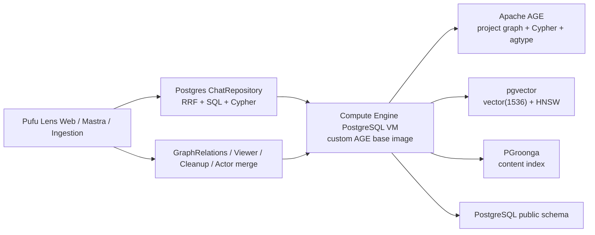
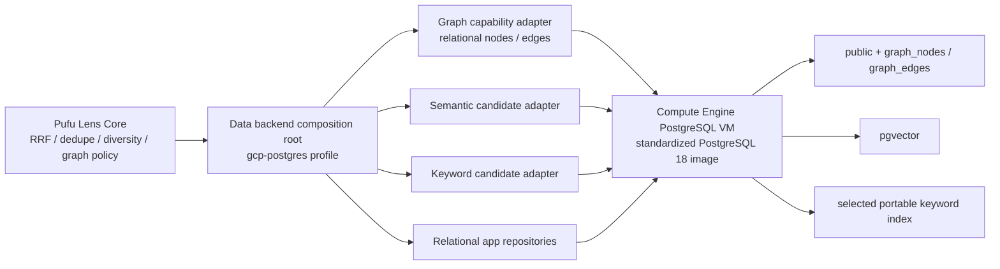
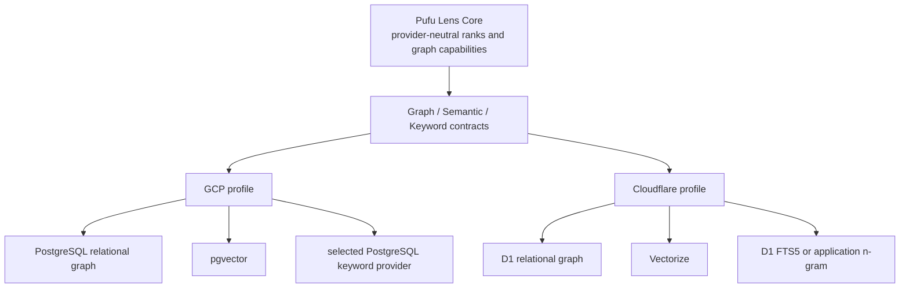

# Cloud-portable data backends 7 Step 移行計画

- status: `active`
- 作成日: 2026-08-19
- 親 Issue: [#704](https://github.com/dyson-yamashita/pufu-lens/issues/704)
- 対象: GCP PostgreSQL VM の継続利用、data / retrieval boundary、Cloudflare adapter、backend parity 評価

## 1. 目的

GCP の Compute Engine PostgreSQL VM を正式 backend として維持しながら、Pufu Lens Core から
Apache AGE、PGroonga、pgvector の具体 API を分離する。GCP では relational graph と portable
keyword search を先に安定化し、同じ capability contract の後ろへ Cloudflare D1 / Vectorize
等の adapter を追加できる状態にする。

この計画の完了時点で必要なのは、単に両環境で起動することではない。Graph、semantic search、
keyword search、RRF、Chat source selection の意味と project isolation を provider 間で比較し、
品質・性能・運用コストを根拠に切替可否を判断できることを目標とする。

### Non-goals

- この plan 作成 PR で本番 DB、VM、Cloudflare resource を変更しない。
- GCP PostgreSQL VM を Cloud SQL 等へ移行しない。
- AGE 互換の汎用 Cypher engine を実装しない。
- AGE と PGroonga を同時に撤去しない。
- Cloudflare へ Web / Mastra / ingestion runtime 全体を一括移行しない。
- provider 差を隠す巨大な database abstraction や任意 SQL / Cypher interface を公開しない。
- 評価前に GCP keyword provider または Cloudflare keyword provider を固定しない。

## 2. 調査範囲と確認結果

### 2.1 調査した正本

- fresh DB: `infra/docker/postgres/init.sql`
- 既存 DB migration: `infra/db/baseline/0000_baseline.sql`、`infra/db/migrations/*.sql`
- PostgreSQL image / VM: `infra/docker/postgres/Dockerfile`、`infra/gcp/postgres-startup.sh`
- Chat / retrieval: `apps/web/src/chat.ts`、`apps/web/src/private-chat-search.ts`、
  `apps/web/src/private-chat-graph-coverage.ts`
- Graph ingestion / mutation: `packages/ingestion/src/graph-relations.ts`、
  `scripts/index-graph-relations.ts`、`packages/graph/src/postgres-age-mutation.ts`、
  `apps/web/src/actor-merge-use-case.ts`、`apps/web/src/admin-data-source-actions.ts`
- Graph read / Viewer: `apps/web/src/graph-viewer.ts`、Graph API routes
- tests: PostgreSQL roundtrip、graph coverage DB、Actor merge DB、Synthetic Monitor DB、
  Graph Viewer、private chat、chat eval fixtures
- operations / designs: DB migration、Graph relations、chunk embedding、Synthetic Monitor、
  deploy checklist、system design 01 / 02 / 03 / 06 / 07 / 11 / 12 / 13 / 16
- active plan: `docs/plans/016-gcp-cost-optimization/overview.md`

`docs/plans/plan-status.md` で `completed` / `deprecated` の plan は参照対象から除外した。

### 2.2 live inventory の扱い

2026-08-19 に read-only の `gcloud compute` inventory を試みたが、ローカル credential が再認証を
要求し、非対話実行では取得できなかった。この plan では tracked な 2026-08-03 実施記録を
baseline とする。

- project / region / zone: `pufu-lens` / `asia-east1` / `asia-east1-b`
- DB VM: `pg-ai-cos`、`e2-custom-small-3072`、deletion protection 有効
- disk: 20 GB boot disk と 50 GB data disk `pg-ai-data`
- database: PostgreSQL 18.1、AGE、pgvector、PGroonga、pgcrypto を確認済み
- network: Direct VPC 専用 subnet、private PostgreSQL 接続

Step 4 / 5 の Issue 着手時は再認証済み read-only command で machine type、disk、image digest、
PostgreSQL / extension version、connection、backup / snapshot、直近 utilization と cost を再取得する。
この再取得ができない状態では production rollout の設計を確定しない。

## 3. 現状依存関係 inventory

### 3.1 機能別一覧

| 分類               | 現在の実装                                                                           | 主な利用箇所                                                                                                                 | GCP 方針                                                                          | Cloudflare 方針                                                    | 主な移行リスク                                                                  |
| ------------------ | ------------------------------------------------------------------------------------ | ---------------------------------------------------------------------------------------------------------------------------- | --------------------------------------------------------------------------------- | ------------------------------------------------------------------ | ------------------------------------------------------------------------------- |
| Graph              | Apache AGE 1.7.0、project 別 graph、Cypher、agtype                                   | ingestion、Chat coverage / graph-query、Viewer、Actor merge、Document cleanup、Synthetic Monitor、project create/delete、CLI | `graph_nodes` / `graph_edges` と capability-level Graph repository へ移行         | D1 上の同等 relational schema を第一候補として検証                 | AGE にだけ存在する node / edge、edge dedupe、Actor merge atomicity、2-hop 性能  |
| Semantic search    | `document_chunks.embedding vector(1536)`、HNSW `vector_cosine_ops`、`<=>`            | `ChatRepository.hybridSearch`、distance 計測 script、embedding ingestion                                                     | pgvector を継続し adapter 内へ隔離                                                | Vectorize cosine index を第一候補として検証                        | 1536 次元上限、float32、project filter、topK、score 尺度、非同期 index 更新     |
| Keyword search     | PGroonga index、`&@~`、`pgroonga_query_escape`、`pgroonga_score`                     | `ChatRepository.hybridSearch` と期間付き検索                                                                                 | PostgreSQL FTS / `pg_trgm` / application n-gram を固定 eval で比較して選定        | D1 FTS5 / application n-gram を固定 eval で比較                    | 日本語・固有名詞・部分一致の recall、escaping、ranking、index/write cost        |
| Fusion / selection | SQL 内 RRF、`k=60`、Core の score-aware cutoff / dedupe / diversity / graph coverage | `apps/web/src/chat.ts`、`private-chat-search.ts`                                                                             | provider rank を正規化して Core に残す                                            | 同一 Core policy を使用                                            | 現在 SQL 内にある RRF を移す際の順序差、candidate 上限差                        |
| Relational data    | PostgreSQL public schema                                                             | auth、project、ingestion、chat history、report、ActivityPub 等                                                               | Compute Engine PostgreSQL VM 継続                                                 | data / retrieval parity の範囲だけ D1 mapping を検証               | PostgreSQL / SQLite dialect、UUID / JSONB / array / transaction / constraint 差 |
| Crypto             | `CREATE EXTENSION pgcrypto`、DDL の `gen_random_uuid()`                              | UUID default。`crypt` / `digest` / encrypt / decrypt の SQL 実利用なし                                                       | PostgreSQL 18 core `gen_random_uuid()` で代替できることを drift test 後に削除候補 | Web Crypto / runtime 生成 UUID。秘密鍵暗号の既存 Node 実装は別境界 | extension を外した fresh / migrated DB drift、UUID default の互換性             |
| Object storage     | LocalFs / GCS の既存 `ObjectStorage` abstraction                                     | raw / parsed / report                                                                                                        | GCS 継続                                                                          | R2 adapter は別 plan または Step 6 spike の補助対象                | data backend と storage migration を同時に広げること                            |

PostgreSQL 18 の公式 docs では `pgcrypto.gen_random_uuid()` は同名 core function を呼ぶ obsolete
wrapper とされているため、現行 SQL 使用状況だけなら pgcrypto は削除候補である。ただし extension
削除は Step 4 で fresh DB / migration / production inventory を再確認してから決定する。

### 3.2 AGE の実利用箇所

| 責務                    | 現行の入口                                                           | 守るべき契約                                                                                 |
| ----------------------- | -------------------------------------------------------------------- | -------------------------------------------------------------------------------------------- |
| project graph lifecycle | `GraphMutationRepository` と project composition root                | project 作成 / 削除と graph lifecycle、adapter 内の graph name 解決 / 検証                   |
| graph materialize       | `GraphIndexingRepository` と `GraphMutationRepository`               | Document / Actor / Topic upsert、全 edge type、idempotent MERGE、失敗時 status               |
| related document lookup | `ChatRepository.graphCoverageQuery` / `graphQueryWithStatus`         | SAME_AS 1-hop、RELATED_TO 1-hop、MENTIONS shared Topic 2-hop、relation 別上限、project scope |
| graph-query fallback    | `apps/web/src/chat.ts`                                               | traversal 失敗と成功 0 件を区別し、title / summary fallback を別 status にする               |
| Viewer presets          | Step 1B 前の `GraphViewerRepository.executePreset`                   | server-owned preset、eligible document 制限、read-only / timeout、normalized node / edge     |
| Actor merge             | `executeActorMerge` / `GraphMutationRepository.mergeActorGraphNodes` | relational reassignment と graph edge 統合 / secondary node 削除の原子性、重複 edge 抑止     |
| Document cleanup        | `GraphMutationRepository.deleteDocumentGraphNodes`                   | project scope、Document node の DETACH DELETE、失敗時の degraded behavior                    |
| monitor / tests         | Synthetic Monitor と DB tests                                        | node presence、9 relation type count、tenant 越境拒否、rollback                              |
| operator CLI            | `query-graph.ts`、`index-graph-relations.ts`                         | project resolver、adapter 内 graph name 検証、bounded batch、再実行、smoke / maintenance     |

AGE の参照は Dockerfile / init SQL だけではない。runtime の `LOAD 'age'`、`cypher(...)`、agtype
parser、test graph create / drop、operations docs まで Step 1 / 2 の移行対象に含める。

### 3.3 Graph の現行 domain と source of truth

現行 graph edge type は `AUTHORED`、`COMMENTED_ON`、`MENTIONS`、`OWNS`、`REPLY_TO`、
`RELATED_TO`、`REVIEWED`、`SAME_AS`、`SENT` の 9 種である。Chat coverage が直接使うのは
`SAME_AS`、`RELATED_TO`、`MENTIONS` の 3 種だが、Viewer、Actor merge、Synthetic Monitor は
他の edge も使うため、Chat だけを見て schema を縮めない。

再生成元の候補は次のとおりである。

- Document identity / type / project: `documents` と `raw_documents`
- parsed relation / Topic / actor mention: Object Storage の parsed JSON
- Actor identity / merge: `actors`、`actor_aliases`、`actor_merge_decisions`
- email quote relation: `email_quotes`
- SAME_AS: project 内の raw `content_hash` と source type
- GitHub lifecycle properties: parsed metadata と relational document metadata

ただし現行 graph に手動または旧 code で作られ、上記から再生成できない row がないことは live DB
で未確認である。Step 2 の最初の gate で AGE export inventory と再生成結果を比較し、差分が 0 または
明示的に廃棄可能と承認されるまで「全 graph は再生成可能」と断定しない。

### 3.4 既存 abstraction の評価

- `ChatRepository` は access、history、raw、timeline、semantic、keyword、graph を一つに持つ。
  Core test seam としては有効だが provider boundary としては広すぎる。
- Step 1 前の `GraphRelationsRepository` は node / edge mutation を domain input で受けていたが、
  project lookup、indexing target read、status 更新、email quote、node / edge mutation が混在していた。
  Step 1B / 1C で `ProjectResolver`、`GraphIndexingRepository`、`GraphReadRepository`、
  `GraphMutationRepository` へ責務を分離し、legacy interface / 実装は廃止した。
- Step 1B 前の `GraphViewerRepository.executePreset` は `cypher`、`graphName`、AGE record definition を
  上位へ露出するため provider boundary としては不適切である。Step 1B で preset ID と normalized result を
  受ける capability に変更する。
- `ObjectStorage`、ActivityPub repositories、ingestion repositories には既存 adapter pattern がある。
  data backend 全体を一つの汎用 repository に統合しない。

## 4. Architecture

### 4.1 Current



### 4.2 GCP target



### 4.3 Cloud-portable target



Cloudflare Workers から既存 GCP PostgreSQL へ Hyperdrive で接続する方式は transition / diagnostic
候補にはなるが、data backend の Cloud portability を達成しないため最終 profile にはしない。

## 5. Target boundary

### 5.1 capability contract

Step 1 では次の責務を provider-neutral input / output に固定する。名前は実装時に既存 package の
命名へ合わせてよいが、責務の再統合はしない。

| capability                    | 最小責務                                                                                             | interface に出さないもの                               |
| ----------------------------- | ---------------------------------------------------------------------------------------------------- | ------------------------------------------------------ |
| `ProjectResolver`             | slug と access context から検証済み `projectId` / project record を得る限定的 bootstrap lookup       | graph / search query、provider 名、任意 SQL            |
| `GraphReadRepository`         | relation 別 1-hop / 2-hop related document、Viewer preset 用 normalized graph、node / relation count | graph name、Cypher、agtype、table name                 |
| `GraphMutationRepository`     | node / edge upsert、Actor merge、document graph cleanup                                              | AGE label syntax、raw SQL、provider transaction object |
| `GraphIndexingRepository`     | graph 対象取得、Actor / Document 解決、email quote 更新、indexing status 更新                        | graph traversal、node / edge storage API               |
| `SemanticCandidateRepository` | project / embedding model scoped の ranked chunk candidate                                           | pgvector distance operator、Vectorize raw score        |
| `KeywordCandidateRepository`  | normalized query に対する ranked chunk candidate                                                     | PGroonga operator / score、FTS5 rank                   |
| Core retrieval policy         | RRF、dedupe、document diversity、score-aware cutoff、graph coverage evidence、final limit            | provider connection / SQL dialect                      |

`ChatRepository` は既存 call site と test seam を保つ facade とし、内部で上記 capability と relational
chat repository を合成する。既存 `GraphRelationsRepository` は project lookup、graph 対象 read、
Actor / Document lookup、indexing status、email quote、node / edge mutation が混在するため、
`GraphMutationRepository` として直接再利用しない。移行 adapter で既存 method を次の境界へ写像し、
call site の移行完了後に legacy interface を廃止する。

- `lookupProjectBySlug` は `ProjectResolver` に分離する。
- `readGraphTargets`、Actor / Document lookup、`replaceEmailQuotes`、`markIndexed` / `markFailed` は
  `GraphIndexingRepository` に分離する。
- `upsertGraphNode` / `upsertGraphEdge` は `GraphMutationRepository` に写像する。同 repository へ
  Actor merge と document cleanup を追加するが、read、project lookup、indexing status は持たせない。
- graph traversal / count は `GraphReadRepository` に置く。
- `GraphViewerRepository` は access lookup と chunk fetch を relational app repository へ分離し、
  `executePreset({ cypher, ... })` を preset ID、検証済み `projectId`、filter を受ける
  `GraphReadRepository` operation に置き換える。

Candidate は少なくとも `chunkId`、`documentId`、`rank`、snippet provenance を持つ。semantic の
raw distance / similarity、keyword の provider score は adapter 内 diagnostics に閉じ、Core の
acceptance criteria は rank と relevance で評価する。

### 5.2 provider selection

- deployment 単位の `PUFU_LENS_DATA_PROFILE=gcp-postgres|cloudflare` を composition root で一度だけ
  解決する。request body、project settings、URL から provider を選ばない。
- profile は Graph / Semantic / Keyword / Relational adapter の有効な組合せを返す。
- test / shadow comparison だけは明示的 dependency injection で新旧 adapter を同時実行する。
- startup 時に必要 binding / env / dimensions / migration version を検証し、不完全な profile は
  fail closed にする。
- capability ごとの override を production public configuration に増やさない。実験が必要な間は
  test / evaluation runner の引数に限定し、Step 7 後に必要性を再判断する。

## 6. 全 Step 共通の不変条件

1. graph / search / mutation の全 read / write は検証済み `projectId` を必須にし、provider 側の
   query / filter / namespace に適用する。例外は `ProjectResolver.lookupProjectBySlug(slug)` 等、
   `projectId` を得る前の限定的な bootstrap lookup だけとする。解決後は slug を query scope として
   直接使わず、必ず resolver が返した `projectId` へ切り替える。
2. request 由来の graph name、SQL、Cypher、index 名を受け取らない。
3. raw content、embedding、OAuth token、DB URL、Cloudflare token を log / fixture / PR に出さない。
4. shadow comparison は document / chunk ID、rank、safe category、latency だけを記録する。
5. schema migration、backfill、reader 切替、旧 backend cleanup を別 PR / 別 rollout にする。
6. mutation と queue consumer は retry-safe / idempotent にし、Cloudflare Queues の at-least-once
   deliveryを前提に idempotency key を持つ。
7. AGE / PGroonga の cleanup は新 backend の soak と rollback window 完了後の別 Step / PR にする。
8. GCP profile に Cloudflare binding や Cloudflare 固有制約を侵入させない。
9. provider raw score の一致を要求しない。security と tenant isolation は tolerance なしで一致させる。
10. 各 Step は独立した Codex task、GitHub Issue、最新 main 由来 branch、ready PR で実施する。

## 7. Step dependency と Issue 分割

| Step | 内容                                     | blocked-by                             | production impact                         | 想定 PR 分割                                              |
| ---- | ---------------------------------------- | -------------------------------------- | ----------------------------------------- | --------------------------------------------------------- |
| 1    | capability boundary と現行 adapter 化    | なし                                   | 挙動変更なし                              | contract / facade、Graph read、Graph mutation の 2〜3 PR  |
| 2    | AGE を relational graph へ置換           | Step 1                                 | schema、dual-write、backfill、read switch | schema、adapter、backfill / shadow、switch、cleanup       |
| 3    | PGroonga keyword search を置換           | Step 1                                 | index、shadow read、search quality        | eval spike、schema / adapter、switch、cleanup             |
| 4    | PostgreSQL VM image / extension を標準化 | Step 2 / 3                             | image rollout、extension cleanup          | image addition、soak、旧 extension cleanup                |
| 5    | GCP PostgreSQL VM 運用を標準化           | Step 4                                 | backup / monitor / upgrade 手順           | observability / runbook、restore drill、cost review       |
| 6    | Cloudflare adapter を具体化 / 実装       | Step 1、Step 2 schema、Step 3 contract | Cloudflare non-production resource        | runtime spike、D1 graph / keyword、Vectorize、composition |
| 7    | GCP / Cloudflare parity 評価             | Step 5 / 6                             | shadow / staging のみ、合格後に切替判断   | eval harness、staging run、結果 / decision                |

各 child Issue には parent `#704`、blocked-by、schema / data migration、production impact、rollout、
rollback、acceptance criteria を記載する。1 Step が review 可能な大きさを超える場合は表の粒度へ
分ける。Step 2 と Step 3 の production read switch を同じ Issue / PR / maintenance window にしない。

## 8. Step 1: DB 固有機能を repository / adapter 境界へ分離する

### 目的

現行 GCP の結果を変えず、Core / use case から AGE、PGroonga、pgvector の構文と score 型を除く。

### 対象コード / schema / infra / docs

- `apps/web/src/chat.ts` と `private-chat-*`
- `packages/ingestion/src/graph-relations.ts`、`scripts/index-graph-relations.ts`
- `apps/web/src/graph-viewer.ts`、graph API routes、Actor merge、Document cleanup
- `apps/mastra/src/mastra/index.ts` と Web route の composition root
- relevant unit / DB tests、system 02 / 03 / 06 / 07、operations docs
- schema / infra の変更なし

### 事前調査

- `ChatRepository` の全 method と call site を分類し、access / history / raw / timeline を今回の
  provider interface へ混ぜない。
- `GraphRelationsRepository` の既存 in-memory test と Postgres adapter を inventory する。
- `GraphViewerRepository` の preset / row normalization と public / private authz 境界を確認する。
- SQL 内 RRF、candidate limit、chunk provenance、graph fallback status を golden test 化する。

### 設計判断と根拠

- 検索 provider interface は `SemanticCandidateRepository` と `KeywordCandidateRepository` に限定し、
  access / history / raw / timeline を混ぜない。Graph は `ProjectResolver`、
  `GraphIndexingRepository`、`GraphReadRepository`、`GraphMutationRepository` に分け、既存
  `GraphRelationsRepository` を新 contract として直接再利用しない。既存 `ChatRepository` は facade とする。
- RRF `k=60`、document dedupe、diversity、confidence、graph coverage policy は Pufu Lens 固有 logic
  なので Core に移す。
- provider adapter は rank 付き候補を返し、raw score を application contract にしない。
- `graphName` は AGE adapter の内部 detail とし、新 contract は `projectId` だけを受ける。

### 実装内容

1. provider-neutral candidate / graph DTO と runtime guard を追加する。
2. 現行 PostgreSQL SQL を semantic / keyword adapter に分離し、Core RRF へ同じ候補を渡す。
3. AGE read / mutation を新 contract に接続する薄い adapter を作る。
4. Graph Viewer preset は Core の preset enum と normalized node / edge query に変更する。
5. composition root で `gcp-postgres` profile を組み、既存 route / workflow から注入する。
6. provider-specific error を `unavailable` / safe internal error へ正規化する。

### データ移行

なし。既存 table、AGE graph、PGroonga index、pgvector column をそのまま使う。

### backward compatibility

- private / public Chat API、tool call 名、source response、Graph API response を変更しない。
- existing `graphName` DB column は残すが Core contract へは渡さない。
- SQL / AGE adapter の結果を golden fixture と DB roundtrip で旧実装と一致させる。

### test / evaluation

- Web / Mastra / ingestion unit tests
- PostgreSQL roundtrip、graph coverage DB、Actor merge DB、Synthetic Monitor DB、Graph Viewer
- 同一 fixture に対する旧 / 新 facade の candidate ID、rank、snippet chunk ID、status の完全一致
- `pnpm format:check`、`pnpm lint`、`pnpm typecheck`、`pnpm test`
- 変更 Markdown に対する `pnpm exec markdownlint-cli2 <changed-files>`。root の `pnpm lint` も
  `markdownlint-cli2` を含むため、targeted check と repository 全体 check の両方で coverage を確認する。

### observability

provider profile、capability、success / unavailable、candidate count、latency の low-cardinality metric を
定義する。query、content、raw score、document ID は log に出さない。

### rollout

1. adapter を既定経路の後ろに入れるが SQL / Cypher は現行のままにする。
2. staging / local DB で golden comparison を行う。
3. GCP へ挙動変更なしの refactor として deploy し、Chat / Graph / ingest smoke を行う。

### rollback

schema / data 変更がないため、前 revision へ戻す。新旧実装を長期間 feature flag で残さず、PR 単位で
revert 可能に保つ。

### 完了条件

- Core / use case / route に `cypher`、`agtype`、`pgroonga_*`、`<=>` が存在しない。
- backend-specific SQL / parser が adapter module に集約される。
- 現行 GCP の retrieval / graph tests と smoke が同じ結果で成功する。

### 次 Step gate

Step 2 / 3 は、旧 / 新 facade parity、project 越境 test、runtime guard、provider metric が通ってから
開始する。

### 想定 Issue / PR

- 1A: candidate contracts、Core RRF、Postgres semantic / keyword adapter
- 1B: Graph read / Viewer capability と AGE adapter
- 1C: Graph mutation / cleanup / Actor merge capability と AGE adapter、composition root

## 9. Step 2: Apache AGE を relational graph schema へ置き換える

> 進捗（2026-09-03）: Step 1A〜1C は PR #707 / #709 / #711、2A は Issue #712 / PR #713、
> 2B は Issue #714 / PR #715、2C「rebuild / compare CLI と source-of-truth audit」は Issue #716 / PR #717 で
> merge 済み。2D は Issue #718 で開始gateを調査し、live AGE inventory / compareの証跡と差分判断が未取得のため
> `blocked`（実装未着手）とする。既存 AGE primary composition、本番 DB、read / write profile は維持する。

2026-09-03のレビュー対応でstorage公開entry pointへの依存を明示し、SQLの実行時検証とstorage設定なしの
compare CLI成功検証を追加した。構造差分の合計出力名はnode / edge双方を表す`labelPropertyKeyMismatchCount`とする。

#### 2A 実装記録（Issue #712）

- `0026_relational_graph_schema` と fresh DB `init.sql` に、project-scoped な `graph_nodes` / `graph_edges`、
  source / target composite FK cascade、outgoing / incoming indexをadditiveに追加する。
- provider-neutral canonical registryを`GRAPH_EDGE_TYPES` 9種へ固定し、migration / fresh schemaの
  `relation_type` CHECKとのdrift testを追加する。既存`GraphRelationType`は互換aliasとして維持する。
- DB testでunknown relation、orphan / cross-project endpoint、project / Document node cascade、Actor mergeに
  必要なedge-first / conflict dedupe / secondary delete / transaction rollbackのschema契約を固定する。
- 2Aではdata backfillを行わず、AGE extension、`projects.graph_name`、AGE adapter、read / write profileを維持する。
  relational adapter / Viewer / monitorは2B、live AGE inventory / source-of-truth auditは2Cへ残す。

#### 2B 実装記録（Issue #714 / PR #715）

- `@pufu-lens/graph` にrelational read / mutation adapterの明示subpath exportを追加し、project-scopedな
  node / relation count、SAME_AS / RELATED_TO 1-hop、MENTIONS 2-hop、Viewer presetをbounded SQLで実装する。
- 9 edge typeのidempotent upsert、SAME_AS canonicalization、project lifecycle、Document node cleanup、
  Actor mergeのedge-first rewire / dedupe / rollbackを実装し、unit / 実PostgreSQL DB testで固定する。SAME_ASの
  endpoint順序はUTF-8 byte順とし、merge SQLの明示的な`COLLATE "C"`とapplication実装を一致させる。
- ViewerとSynthetic Monitorは明示DIしたrelational adapterで検証する。productionのAGE primary composition、
  `projects.graph_name`、API / 認可 contractは変更しない。
- 2Bではmigration、backfill、live AGE inventory、dual-write / shadow read、production switchを行わない。
  source-of-truth auditと再生成可能性判定は2Cのgateとして残し、2Bのready PRがmergeされるまで開始しない。

#### 2C 実装記録（Issue #716 / PR #717、merge済み）

- `graph:migrate rebuild`にdry-run / execute、project、bounded limit、SHA-256 digestのresume cursorを追加し、
  current parsed documentsからrelational graphをidempotentにupsertする。executeの1 batchは単一transactionで、
  途中失敗時は全更新をrollbackする。parsed artifact読取は最大8並列とし、ingestion statusと`email_quotes`は変更しない。
- `graph:migrate compare`はAGE / relationalのnode / edge identityをprocess内でdigest化し、count、duplicate、orphan、
  unknown relation、片側だけのrow、label / property-key drift、source audit categoryだけを出力する。SAME_ASは
  endpointをcanonicalizeし、AGEのphysical labelとprovider-neutral `graphLabels`の和集合を比較する。全readは
  同一の`REPEATABLE READ READ ONLY` transaction / sessionで実行する。
- Actor merge decision / secondary参照、Document cleanup相当のorphan、lifecycle-only refreshのfull rebuild契約を
  unit / local PostgreSQL + AGE DB testで固定する。既存relational rowはsource完全性確認前に全削除しない。
- local synthetic fixtureでrepresentative 1-hop / 2-hopと`properties ->> 'documentId'`のEXPLAIN手順を確認する。
  production相当row count / p95は未取得のためexpression indexを追加せず、後続の実測gateに残す。
- 2CではDDL migration、production DB実行、deploy、dual-write / shadow read、production switchを行わない。
  live AGE inventoryは認証済み接続を取得せず未実施であり、全graphを再生成可能とは断定しない。live compareの
  差分ゼロまたは明示decisionを2D開始gateとして残す。

#### 2D 開始gate確認（Issue #718）

- status: `blocked`（実装未着手）、更新日: 2026-09-03、親Issue: #704、depends-on: #717（merge済み・依存解消）。
  現在の停止理由はlive compare証跡・差分判断の承認待ちであり、Issue #718で管理する。
- 最新origin/mainを再取得し、PR #717のmerge commit `ed138eaf183ff80f59442452ae38ae0df3816d86`を確認した。
  #704 / #716 / #717とtrackedな設計・運用記録から、有効なlive compare結果や承認済みdecision logは見つからなかった。
  PR #717本文もlive AGE inventory未実施を明記している。local synthetic DBのparityはlive gateの代用にしない。
- この作業環境ではDB接続設定を確認できず、gcloud認証ファイルは存在確認だけにとどめた。認証の有効性、DB到達性、
  対象project、比較先relational graphのschema適用・rebuild状態は未確認である。secret値の取得、本番接続は行っていない。
- 再開には対象環境・project範囲・実行日時・code/schema version・sanitized count・truncation有無を伴うlive compareの
  `pass`、または実測差分に対する承認済みdecision logが必要である。新規実行時の対象・接続・権限・timeout・ログ方針と
  read-only実行条件案はIssue #718に記録した。production inventory / compareの明示承認前には実行しない。
- 現行compareはread-only transactionを使うが、statement / lock / transaction timeoutを明示設定しない。
  node / edgeのlimitはsource auditの集計件数やDB scan量を制限しないため、live実行前に接続側の制限を確定・確認する。
  比較先が未backfillの場合も自動でrebuildせず、別途対象・影響・rollbackと書込み承認を確認する。
- 本記録は2D開始・完了、差分容認、production操作の承認を意味しない。文書同期PRではIssue #718を閉じない。
  2Eは2D完了、対象projectのbackfill / compare・shadow観測とmismatch判断、性能 / cost、restore point / rollback計画、
  production切替の明示承認を満たした後、独立タスクで着手する。

### 目的

Pufu Lens が使う bounded graph capability を通常の relational node / edge schema で実装し、まず GCP
PostgreSQL VM 上で AGE なしに同等 behavior を提供する。

### 対象コード / schema / infra / docs

- 新 migration と `infra/docker/postgres/init.sql`
- Graph read / mutation Postgres adapter、ingestion graph indexer、Actor merge、cleanup、Viewer、monitor
- backfill / shadow comparison CLI と DB tests
- data model、ingestion、Chat、deployment、Graph operations、DB migration docs

### 事前調査

- production AGE graph を read-only export し、project、label、edge type、property key、node / edge count、
  duplicate、orphan、AGE-only row を content なしで inventory する。
- parsed JSON + relational row から再生成した shadow graph と AGE export を project ごとに比較する。
- Actor merge decision、lifecycle-only refresh、Document cleanup 後の再生成規則を確認する。
- representative 1-hop / 2-hop query の EXPLAIN と row count を取得する。
- `graph_nodes.properties ->> 'documentId'`を使う代表queryも`EXPLAIN (ANALYZE, BUFFERS)`で計測し、
  expression indexはその結果を2Cの追加判断gateとする。

### 設計判断と根拠

推奨 schema は次とする。`node_key` は既存 `graphNodeId` を維持し、UI / ingestion identity を一度に
変更しない。

```text
graph_nodes
- project_id
- node_key
- kind              # document / actor / topic
- subtype           # doc type / topic type 等
- properties        # provider-neutral JSON / JSONB
- created_at / updated_at
- PRIMARY KEY (project_id, node_key)
- FOREIGN KEY (project_id) -> projects(id) ON DELETE CASCADE

graph_edges
- project_id
- source_node_key
- target_node_key
- relation_type
- properties
- created_at / updated_at
- PRIMARY KEY (project_id, source_node_key, target_node_key, relation_type)
- FOREIGN KEY (project_id, source_node_key)
    -> graph_nodes(project_id, node_key) ON DELETE CASCADE
- FOREIGN KEY (project_id, target_node_key)
    -> graph_nodes(project_id, node_key) ON DELETE CASCADE
```

- project deletion は `projects` から `graph_nodes`、両 endpoint FK から `graph_edges` への cascade で
  project 内 graph を削除する。
- Document cleanup は exclusivity 判定と同じ transaction で対象 `graph_nodes` を削除し、incident edge は
  endpoint FK の cascade で削除する。
- Actor merge は同じ transaction 内で primary node へ edge を upsert / dedupe し、旧 incident edge を
  明示削除してから secondary node を削除する。node delete の cascade を merge の edge 移送手段にはしない。
- outgoing `(project_id, source_node_key, relation_type, target_node_key)` と incoming
  `(project_id, target_node_key, relation_type, source_node_key)` index を作る。
- `relation_type` 単独 project index と Viewer の recent document selection 用 index を計測する。
- edge identity は現行 `MERGE (from)-[type]->(to)` と同じ source / target / type とし、properties は
  upsert する。Actor merge 時は conflict で重複を吸収する。
- `AUTHORED` 等の Actor / Document edge、`MENTIONS`、`RELATED_TO` は格納方向を維持する。
  `SAME_AS` は読取契約が無向なので、両 endpoint を UTF-8 byte 順に canonicalize して reverse duplicate を
  作らない。PostgreSQL側は明示的な`COLLATE "C"`で同じ順序を使う。既存 AGE の双方向 duplicate は
  canonical comparison で一件へ正規化する。
- label を可変 table にせず `kind` / `subtype` の許可値を guard する。
- 9 種の edge type を列挙する `GRAPH_EDGE_TYPES` を canonical registry とし、`GraphEdgeType` は同定数から
  導出する。PostgreSQL / D1 migration の `relation_type` CHECK、adapter の write validation、upsert / query、
  parity test fixture は同じ registry から生成または drift test し、未知の値を保存境界で拒否する。
- Graph query は任意 traversal ではなく capability ごとの bounded SQL とする。

### 実装内容

1. additive migration で graph tables、FK、unique、index を追加する。
2. relational Graph adapter を追加し、9 edge type の idempotent upsert / delete / merge を実装する。
3. SAME_AS / RELATED_TO 1-hop、shared Topic MENTIONS 2-hop を project-scoped SQL で実装する。
4. Viewer preset と Synthetic Monitor count を relational query へ実装する。
5. `--dry-run` / project / limit / resume cursor を持つ rebuild / compare CLI を追加する。
6. AGE primary + relational shadow write、AGE read + relational shadow read comparison を導入する。
7. gate 合格後に relational primary read、AGE fallback、最後に relational-only write へ段階移行する。

### データ移行

基本方針は source data からの graph 再生成とする。AGE one-time export/import は AGE-only row が見つかり、
正当な source of truth と判断された場合だけ採用する。dual-write + backfill + shadow read を使い、単一
migration transaction で graph 全体を移さない。

### backward compatibility

- `graphNodeId`、Graph API node / edge shape、Chat relation type / hop count / status を維持する。
- `projects.graph_name` は rollback window 中残し、AGE cleanup 後の別 migration で nullable / 削除を判断する。
- AGE reader fallback は rollback window 中だけ残し、永続的な二重正本にしない。

### test / evaluation

- 9 edge type の upsert / dedupe / incoming / outgoing / delete、未知の `relation_type` の拒否と
  canonical registry / DB CHECK の drift
- SAME_AS / RELATED_TO / MENTIONS の candidate set、relation pool、hop count、deterministic order
- Actor merge の edge rewire、duplicate suppression、secondary node delete と transaction rollback
- project deletion、Document cleanup、Actor merge の transaction / cascade、Viewer presets、
  Synthetic Monitor、project isolation、orphan FK
- AGE / relational の project 別 node / edge count、canonical edge set、representative query parity
- 10x production row 相当 fixture で 1-hop / 2-hop p50 / p95 と index usage

### observability

backend 別 query / mutation latency、candidate count、shadow mismatch category、backfill progress、retry、
orphan / duplicate countを記録する。properties や document identity は log に出さない。

### rollout

1. schema追加。
2. relational shadow write。
3. project 単位 backfill と compare。
4. shadow read を十分な実 query で観測。
5. relational primary + AGE fallback。
6. soak 後に AGE write 停止。
7. Step 4 で AGE package / extension cleanup。

### rollback

read profile を AGE primary に戻す。dual-write 中は AGE を正本として維持する。relational table は
additive なので rollback 時に削除せず、原因調査後に forward fix / rebuild する。

### 完了条件

- representative graph query、coverage、Actor merge、cleanup、Viewer、monitor が relational backend で通る。
- AGE と relational の security-sensitive behavior は完全一致し、許容した data 差分は decision log に残る。
- production primary read が relational で soak し、AGE fallback が発火しない。

### 次 Step gate

Step 4 の AGE removal は、全 project backfill、shadow mismatch 解消、restore point、rollback window、
最低 7 日の relational primary soak が完了してから行う。

### 想定 Issue / PR

- 2A: graph schema / DB tests
- 2B: relational Graph adapter / Viewer / monitor
- 2C: rebuild / compare CLI と source-of-truth audit
- 2D: dual-write / shadow read
- 2E: production read / write switch
- 2F: AGE fallback / compatibility cleanup（Step 4 と連携）

## 10. Step 3: PGroonga keyword search を portable 実装へ置き換える

### 目的

GCP PostgreSQL VM 上の keyword candidate retrieval を、Pufu Lens の日本語・固有名詞・技術語 query
品質を保つ方式へ変更し、provider-neutral rank contract に載せる。

### 対象コード / schema / infra / docs

- keyword adapter、Core RRF、期間付き search
- `document_chunks` の additive search column / auxiliary table / index 候補
- migration、init SQL、evaluation fixture / runner、chunk ingestion write path
- Chat / chunk embedding / DB migration / deployment docs

### 事前調査

同一 snapshot で次を比較する。

1. PostgreSQL 18 built-in FTS（`simple` configuration と必要な custom normalization）
2. trusted contrib extension `pg_trgm` の GIN / GiST、`LIKE` / similarity
3. application で正規化した bigram / trigram token table
4. 上記の組合せ

PostgreSQL built-in parser は一つで、configuration / dictionary により token 正規化を行う。日本語の
word boundary と typo / partial match が要件を満たすとは仮定せず、`ts_debug` と固定 corpus で確認する。

### 設計判断と根拠

- この plan では provider を確定しない。SQL 成功ではなく retrieval quality gate で選ぶ。
- candidate adapter は `{ chunkId, documentId, rank, snippet }` を返す。provider score は diagnostics のみ。
- query normalization は Core 共有の Unicode normalization と安全な tokenization を先に適用し、SQL
  escaping は adapter に閉じる。
- GCP の選定順は「品質 gate を満たす最も運用が単純な方式」とする。built-in FTS が日本語要件を
  満たさなければ、`pg_trgm` または application n-gram を採用してよい。

### 実装内容

1. category / relevance judgment 付き keyword evaluation set と offline runner を作る。
2. 候補ごとの additive schema / index を staging に作り、同じ corpus を投入する。
3. PGroonga primary + candidate shadow query で rank / latency / errors を比較する。
4. 選定方式を ingestion / update / delete path に接続する。
5. Core RRF へ selected keyword ranks を渡し、PGroonga と final hybrid 結果を比較する。
6. selected primary + PGroonga fallback、soak、fallback 停止を段階実施する。

### データ移行

content 自体の copy は不要だが、generated search vector / auxiliary token row / index の backfill が必要に
なる。migration と backfill CLI を分け、project / document range、`--dry-run`、resume cursor、進捗 query
を持たせる。

### backward compatibility

- Chat API と RRF `k=60` を維持する。
- PGroonga index は rollback window 中残す。
- selected provider が keyword candidate 0 件または error の場合の fallback / unavailable を明示する。

### test / evaluation

- 日本語、英数字混在、人名、product / project 名、Issue / PR 番号、URL / repository 名、
  `ActivityPub` 等の技術語、typo、部分一致、空 / 記号 query、escaping 攻撃
- Top-K overlap、Recall@K、MRR、nDCG@K、hybrid final document 差、RRF 後採用差
- index size、backfill / write amplification、p50 / p95、EXPLAIN、concurrent ingest 中の検索
- project isolation、query injection、max query length

### observability

provider、candidate count、latency、timeout、fallback、shadow mismatch bucket を記録する。query 本文、
snippet、provider raw score は log しない。

### rollout

1. eval-only schema / index。
2. shadow query。
3. selected provider primary + PGroonga fallback。
4. GCP staging / production quality gate と soak。
5. Step 4 で PGroonga package / extension / index cleanup。

### rollback

PGroonga primary へ profile を戻す。新 index / token rows は残し、再 backfill または forward fix に使う。
PGroonga cleanup 後の rollback は旧 image + backup / forward migration を伴うため、cleanup 前に終了条件を
明示する。

### 完了条件

- category 別 quality tolerance と latency / index / write cost gate を満たす。
- hybrid final selection と Chat eval に重大な regression がない。
- PGroonga fallback が production soak 中に発火しない。

### 次 Step gate

Step 4 の PGroonga removal は、固定 eval の合格、全 chunk backfill、fallback 0、最低 7 日 soak、
restore point 完了後にだけ行う。

### 想定 Issue / PR

- 3A: keyword evaluation corpus / runner
- 3B: PostgreSQL FTS / pg_trgm / n-gram spike と decision record
- 3C: selected schema / adapter / backfill
- 3D: shadow / primary switch
- 3E: PGroonga fallback cleanup（Step 4 と連携）

## 11. Step 4: PostgreSQL VM を標準的な構成へ整理する

### 目的

AGE / PGroonga なしで GCP profile が動くことを確認した後、Compute Engine VM 上の PostgreSQL image、
extension、startup / health check を最小構成へ整理する。VM と data disk は維持する。

### 対象コード / schema / infra / docs

- `infra/docker/postgres/Dockerfile`、`infra/docker/postgres/init.sql`
- `infra/gcp/postgres-startup.sh`、deploy image build / migration order、infra check
- AGE / PGroonga / pgcrypto cleanup migration、baseline / schema drift
- Synthetic Monitor、deploy smoke、backup / restore / deployment / tech stack docs

### 事前調査

- live VM から image digest、PostgreSQL / OS / extension version、config、data / boot disk mount を
  read-only で inventory する。
- code、SQL、tests、scripts、docs に `age` / `pgroonga` / `pgcrypto` runtime dependency が残って
  いないことを `rg` と DB smoke で確認する。
- pgvector の supported PostgreSQL 18 package / image、upgrade cadence、HNSW rebuild compatibility を確認する。
- selected keyword provider が必要とする package / contrib extension を確認する。

### 設計判断と根拠

- GCP semantic search は pgvector を継続する。現行 HNSW / 1536 dimension と embedding pipeline の
  回帰リスクに対し、Step 1 の adapter 隔離だけで Cloudflare portability を確保できるためである。
- target extension は原則 `vector` と、Step 3 で選んだ方式に必要な extension だけとする。
- pgcrypto は SQL 実利用が core `gen_random_uuid()` だけであることを再確認できれば削除する。
- custom image の継続可否は、official PostgreSQL base + reproducible pgvector install と current image の
  build / CVE / startup / restore を比較して決める。custom image を「特殊 extension が減ったから」だけで
  即廃止しない。
- base image / extension package は immutable digest と version を記録する。

### 実装内容

1. target image を別 tag で build し、fresh DB / baseline + migrations / schema drift を実行する。
2. AGE / PGroonga なしの staging restore clone で graph / search / chat / ingestion / report を検証する。
3. runtime extension checks、startup script、health check、infra check を target 構成へ変更する。
4. replacement image を current VM へ rollout し、data disk / DB major version を同時に変更しない。
5. soak 後、別 cleanup migration で AGE / PGroonga extension / index / graph catalog dependency を除く。
6. pgcrypto removal 条件を満たせば fresh / migrated DB の両方から除く。

### データ移行

Step 2 / 3 の backfill は完了済みであること。Step 4 では VM / data disk を移行しない。extension DROP
前に logical backup と Persistent Disk application-consistent snapshot を取得し、object / dependency
inventory を保存する。

### backward compatibility

- PostgreSQL major version、port、database name、private IP、`DATABASE_URL` contract、data disk を維持する。
- old image tag / digest と startup metadata を rollback window 中保持する。
- extension DROP は image switch と同時に行わず、新 image soak 後の別操作にする。

### test / evaluation

- target image build、fresh init、migration replay、schema drift、extension inventory
- unit / DB / E2E / deploy dry-run / smoke / Synthetic Monitor
- restore clone で graph / keyword / semantic / Chat eval
- restart / cold start / connection pool reconnect、HNSW / keyword index present、backup restore list
- CPU / memory / disk / connection / latency と current image の比較

### observability

PostgreSQL / container version、image digest、extension version、restart、OOM、connection、query p95、
index bytes、vacuum / bloat、disk usageを記録する。secret や DB URL は記録しない。

### rollout

1. local CI image。
2. isolated restore clone。
3. staging / non-production VM。
4. production backup / snapshot。
5. current VM image switch。
6. smoke / soak。
7. extension cleanup。

### rollback

- extension cleanup 前: old image digest へ戻して restart する。
- extension cleanup 後: forward fix を優先し、必要なら snapshot / logical backup から isolated restore して
  切替する。target data disk を上書き restore する前に原因と対象を再確認する。

### 完了条件

- AGE / PGroonga を使わず Graph / hybrid search の acceptance criteria を満たす。
- target image / startup / rebuild / extension version が再現可能である。
- VM は削除 / 置換されず、GCP cost baseline を不必要に増やしていない。

### 次 Step gate

Step 5 は production image soak、backup / restore evidence、全 scheduled workload 成功、resource inventory 更新後に
開始する。

### 想定 Issue / PR

- 4A: minimal image spike / CI / restore clone
- 4B: runtime checks / docs / deploy config
- 4C: production image rollout 記録
- 4D: AGE / PGroonga / pgcrypto cleanup migration

## 12. Step 5: GCP PostgreSQL VM 継続運用を標準化・安定化する

### 目的

新しい relational graph / keyword / pgvector 構成を GCP の正式 backend とし、backup、restore、upgrade、
monitoring、cost review を追跡可能にする。

### 対象コード / schema / infra / docs

- infra / deploy checks、Synthetic Monitor、Cloud Monitoring / Logging definition
- backup / snapshot / restore drill、image rebuild、major upgrade runbook
- deployment / security / cost / DB migration / deploy checklist docs
- `docs/plans/016-gcp-cost-optimization` の tracked baseline との整合

### 事前調査

- machine type、memory、boot / data disk、Direct VPC、firewall、Secret Manager、deletion protection、
  Artifact Registry image、startup metadata を live inventory する。
- application process / job ごとの connection pool、max instance / task、PostgreSQL max connections を棚卸しする。
- logical backup、snapshot、restore drill、retention、RPO / RTO、直近成功時刻を確認する。
- CPU / memory / swap / disk / connection / query / vacuum / bloat / image build / Artifact Registry cost を
  7〜30 日で baseline 化する。

### 設計判断と根拠

- VM / Direct VPC / private DB を GCP profile の正規構成として維持する。
- backup は logical backup と application-consistent Persistent Disk snapshot の二層を維持する。
- restore drill は source VM を変更せず isolated target へ復元し、schema / row count / graph / search smoke を行う。
- PostgreSQL major、pgvector、selected keyword extension、OS / image の upgrade を別 maintenance operation にする。
- Cloudflare の quota、binding、schema を GCP runbook に持ち込まない。

### 実装内容

1. sanitized inventory / version manifest と drift check を自動化する。
2. graph nodes / edges、embedding、keyword index、schema migration を Synthetic Monitor に追加する。
3. CPU / memory / connection / disk / bloat / vacuum / latency / error alert を定義する。
4. backup / snapshot / restore drill 手順、ownership、retention、evidence format を更新する。
5. image rebuild / CVE / extension / PostgreSQL major upgrade の cadence と rollback を定義する。
6. monthly cost record に VM、disk、snapshot、Artifact Registry、backup、build、DB-related egress を追加する。

### データ移行

なし。restore drill は isolated resource で実施し、production source を変更しない。

### backward compatibility

既存 scheduler、Cloud Run Jobs、Mastra、App Hosting の `DATABASE_URL` / Direct VPC contract を維持する。
monitor / alert の追加は fail-open で application traffic を止めず、deploy gate だけ明示する。

### test / evaluation

- `pnpm infra:check --env production`、deploy smoke、Synthetic Monitor
- logical backup `pg_restore --list` と isolated restore
- restore 後の migration、row count、graph / semantic / keyword / Chat smoke
- restart / cold start / scheduled jobs、connection saturation test
- monthly cost / utilization comparison

### observability

- CPU、memory、swap、container restart、connections、disk、WAL、vacuum / bloat
- graph / keyword / semantic query p50 / p95、error / fallback
- backup age / status、snapshot age / status、restore drill age
- image / PostgreSQL / extension version drift

### rollout

monitor / docs / restore drill を先に整備し、alert threshold は baseline 観測後に有効化する。false positive を
理由に security / backup alert を無効化せず、threshold / aggregation を調整する。

### rollback

monitor / alert definition は前 version へ戻せる。restore drill は isolated resource を削除する前に evidence
を保存する。production config を変更した場合は sanitized previous config と old image digest へ戻す。

### 完了条件

- VM 再構築、backup、snapshot、restore、image rebuild、major / extension upgrade、rollback が runbook で
  追跡できる。
- 新 Graph / keyword / pgvector の monitor と alert がある。
- current machine / disk / fixed cost が baseline と比較され、Cloudflare 対応だけを理由とする増額がない。

### 次 Step gate

Step 7 の GCP baseline は、最低 7 日の stable metrics、最新 restore drill、全 scheduled workload、
retrieval eval snapshot が揃ってから固定する。

### 想定 Issue / PR

- 5A: sanitized inventory / drift / monitoring
- 5B: backup / restore drill runbook と実施記録
- 5C: image / PostgreSQL / extension upgrade policy
- 5D: monthly cost / capacity review

## 13. Step 6: Cloudflare adapter を追加できる設計を具体化する

### 目的

GCP profile の Core logic を変えず、Cloudflare non-production 環境で data / retrieval adapter を構成し、
Step 7 の parity 評価を実行できる状態にする。

### 対象コード / schema / infra / docs

- Workers-compatible composition root / entrypoint と capability adapters
- D1 migrations、relational graph / keyword schema、Vectorize index / metadata definition
- evaluation ingestion / backfill、retry / idempotency、Cloudflare config / secret docs
- contract / integration / miniflare or remote staging tests

### 事前調査

実装 Issue 着手時に Cloudflare 公式 docs を再確認し、次を versioned decision record に残す。

- Workers runtime / Node.js API compatibility、CPU 128 MB memory / subrequest / connection limits
- D1 SQL dialect、10 GB database、100 bind parameters、single-threaded DB、30 秒 query、FTS5、batch transaction
- D1 read replication / Sessions API / bookmark と sequential consistency
- Vectorize dimensions、metric、topK、metadata / namespace / filter / batch limits
- Queues at-least-once、Workflows retry / step / CPU / state limits
- D1 migration / Time Travel、Vectorize backup / rebuild、service pricing

### 設計判断と根拠

| capability             | Cloudflare 第一候補                 | 理由 / 未確定点                                                                                                |
| ---------------------- | ----------------------------------- | -------------------------------------------------------------------------------------------------------------- |
| Relational graph       | D1 `graph_nodes` / `graph_edges`    | Step 2 schema を SQLite 型 / FK / batch に mapping しやすい。2-hop latency / single-thread throughput は要測定 |
| Semantic               | Vectorize cosine / 1536 dimensions  | 現行 embedding dimension と metric を合わせられる。project scope は namespace または metadata filter を比較    |
| Keyword                | D1 FTS5 または application n-gram   | FTS5 は公式対応だが日本語 / typo / partial match 品質は未確定。Step 3 corpus で選ぶ                            |
| Mutation delivery      | direct binding + Queues / Workflows | batch transaction と idempotency key を使う。非同期 Vectorize 更新との consistency を設計する                  |
| Existing GCP DB access | Hyperdrive                          | transition / diagnostic のみ。portable target の正本にはしない                                                 |

- D1 graph / relational write と Vectorize upsert を一つの cross-service transaction とみなさない。
  relational outbox / indexing status と idempotent consumer で再試行する。
- project isolation は D1 query の `project_id` と Vectorize namespace / indexed project metadata の二重で
  実装し、filter missing を startup / test で拒否する。
- Workers では Node-compatible import が成功しても stubbed API の実行は失敗し得るため、existing Node
  module を一括 bundle せず、Workers-compatible entrypoint と dependency contract test を作る。

### 実装内容

1. Workers runtime spike で Core contract、runtime guards、embedding client、required package を bundle / execute する。
2. D1 migrations と Graph read / mutation adapter を実装する。
3. D1 keyword candidate を Step 3 / 7 eval contract に接続する。
4. Vectorize index / metadata / namespace、semantic adapter、upsert / delete / reindex worker を実装する。
5. relational outbox、idempotency key、retry / dead-letter / repair CLI を追加する。
6. `cloudflare` profile の startup binding / schema / dimension guard を実装する。
7. fixed fixture を remote staging へ投入し、GCP snapshot と同一 ID / embedding model を維持する。

### データ移行

production migration は行わない。evaluation 用 sanitized / synthetic fixture と、必要な場合だけ content を
含まない ID / rank snapshot を使う。将来の production migration は別 plan / Issue で consent、PII、region、
retention、egress cost を確認する。

### backward compatibility

- `gcp-postgres` profile の bundle / deploy / env を変更しない。
- Cloudflare profile は明示設定と binding がある non-production deployment だけ有効にする。
- Core DTO / tool call / Chat API contract は GCP と共有する。

### test / evaluation

- Workers local / remote compatibility、bundle size / startup / Node API use
- D1 FK / unique / batch rollback、project scope、1-hop / 2-hop、Actor merge、cleanup
- D1 keyword quality categories / escaping / rank、Vectorize semantic candidate / namespace / filter
- Queue duplicate / reorder / retry / poison message、outbox repair、read-after-write / Sessions bookmark
- D1 / Vectorize quota boundary、128 MB memory、subrequest / connection、p50 / p95
- Step 7 parity runner の同一 fixture

### observability

Workers invocation / CPU / memory outcome、D1 rows read / written / served region / primary、Vectorize query /
upsert、Queue retry / age / dead letter、outbox lag、capability latency / error を low-cardinality で記録する。

### rollout

local / preview -> dedicated Cloudflare staging -> fixed fixture -> shadow evaluation の順とする。production user
traffic、GCP production write、real OAuth / raw content をこの Step へ接続しない。

### rollback

Cloudflare profile deployment を停止し、GCP profile へ影響を与えない。D1 / Vectorize staging resource の
削除は evaluation artifact と cost / retention を確認する別 cleanup Issue で行う。

### 完了条件

- Cloudflare profile が capability contract を実装し、fixed fixture の Graph / semantic / keyword / hybrid
  query を実行できる。
- project isolation、idempotency、repair、runtime / quota limit の tests が通る。
- provider-specific type / binding が Core / GCP adapter に漏れていない。

### 次 Step gate

Step 7 は、同一 fixture version、embedding model / dimensions、schema version、document / chunk ID mapping、
Cloudflare metrics が固定されてから開始する。

### 想定 Issue / PR

- 6A: Workers compatibility / package spike
- 6B: D1 schema / Graph adapter
- 6C: D1 keyword adapter
- 6D: Vectorize adapter / outbox / repair
- 6E: Cloudflare composition / staging fixture

## 14. Step 7: GCP / Cloudflare backend parity を評価する

### 目的

provider raw score の一致ではなく、Pufu Lens が必要な candidate、graph behavior、source selection、Chat
answer quality、latency、cost を再現できるか測定し、Cloudflare backend の採用 / 継続検証 / 不採用を決める。

### 対象コード / schema / infra / docs

- versioned eval fixture / relevance judgments / runner / report schema
- backend adapter test entrypoint、GCP snapshot、Cloudflare staging
- CI の hermetic subset と明示実行 remote evaluation
- Chat / Graph / operations / deployment / cost docs、decision log

### 事前調査

- production content をコピーせず代表性を持つ synthetic / sanitized corpus の category 分布を決める。
- current `private-chat-*.json` と DB tests から query / expected source / graph relation を抽出する。
- GCP stable baseline の candidate / rank / final source / latency / cost を取得する。
- provider の score direction / scale / approximate search / consistency を記録する。

### 設計判断と tolerance

| 対象                      | 指標                                                                        | 合格条件                                                                                                  |
| ------------------------- | --------------------------------------------------------------------------- | --------------------------------------------------------------------------------------------------------- |
| tenant / authz / mutation | cross-project read / write、duplicate、cleanup、Actor merge                 | 100% 一致。漏洩 / 誤更新は 1 件でも fail                                                                  |
| Semantic                  | judged Recall@10、nDCG@10、MRR、GCP Top-10 overlap                          | Recall@10 0.95 以上、nDCG / MRR の GCP 差 -0.05 以内、overlap 0.80 以上                                   |
| Keyword                   | category 別 Recall@20、MRR、必須 exact query                                | 全 category Recall@20 0.90 以上、全体 0.95 以上、MRR 差 -0.05 以内、Issue 番号等の必須 query 100%         |
| Hybrid                    | RRF 後 Top-5 overlap、judged nDCG@10、final document selection              | overlap 0.80 以上、nDCG 差 -0.05 以内、必須 relevant source miss なし                                     |
| Graph read                | SAME_AS / RELATED_TO / MENTIONS candidate set、hop、dedupe、limit           | canonical set / hop / relation 100% 一致。provider 内部順序は Core sort 前のみ不問                        |
| Graph mutation            | 9 edge type、merge、cleanup、orphan、retry                                  | canonical node / edge set 100% 一致                                                                       |
| End-to-end Chat           | source / citation overlap、required tool、rubric                            | source overlap 0.80 以上、required source / citation / tool 100%、critical factual / isolation error 0    |
| Performance               | p50 / p95、index / write latency、DB load                                   | Step 開始前に absolute SLO を固定し、GCP replacement は baseline p95 +25% 以内。Cloudflare は user SLO 内 |
| Cost                      | stored / queried dimensions、D1 rows、Workers CPU、Queue / Workflow、GCP VM | representative 月間 workload の見積りと実測を提示し、採用前に budget owner が判断可能                     |

raw score、完全に同じ順位、完全に同じ自然言語 answer は acceptance criteria にしない。security、project
scope、required evidence、graph mutation は tolerance を設けない。

### 実装内容

1. fixture schema に query category、relevant document / chunk、grade、required relation / tool、forbidden
   cross-project ID、expected failure を定義する。
2. semantic / keyword / hybrid / graph / Chat runner と metrics calculator を実装する。
3. GCP / Cloudflare を同一 fixture / embedding で実行し、machine-readable JSON と Markdown summary を作る。
4. mismatch を score scale ではなく missing / extra / rank / relation / consistency / error に分類する。
5. latency / resource / cost を同じ workload で測る。
6. tolerance 未達を修正して再実行し、採用 decision を記録する。

### データ移行

なし。evaluation fixture だけを versioned に投入する。real production content を provider 間で移送しない。

### backward compatibility

評価 runner は application response schema を変更しない。diagnostics は operator-only artifact とし、public /
private Chat response や history に raw score / internal relation metadata を追加しない。

### test / evaluation

- hermetic metric calculation unit tests と intentionally failing fixture
- GCP / Cloudflare integration run
- repeated runs による approximate search variance と consistency window
- provider outage、timeout、429 / overloaded、duplicate queue、stale read
- final private / public Chat source redaction、citation、timeline / graph coverage

### observability

run ID、fixture / schema / code commit、provider profile、region、embedding model、aggregate metrics、latency、
cost unitだけを記録する。query / content / PII / secret は artifact に含めない。

### rollout

CI では hermetic contract / metric testsを毎回実行し、remote GCP / Cloudflare evaluation は secret と cost を
伴う明示 job で release candidate ごとに実行する。合格しても production Cloudflare cutover は別 plan とする。

### rollback

評価中の primary production backend は GCP のままなので traffic rollback は不要である。Cloudflare staging
の regression は profile deployment を止め、GCP baseline を保持したまま修正する。

### 完了条件

- 全必須 metric と tolerance が machine-readable report で評価される。
- tenant / security / graph mutation の hard gate が通る。
- quality / latency / cost の残差と採用 / 継続検証 / 不採用 decision が文書化される。
- production cutover が必要なら scope、data handling、rollout、rollback を持つ後続 plan / Issue がある。

### 次 Step gate

この 7 Step plan の最終 gate とする。Cloudflare production cutover は自動で開始せず、Step 7 decision と
本番データ / security / cost approval を持つ別 plan を作る。

### 想定 Issue / PR

- 7A: fixture / judgments / metrics library
- 7B: backend runners / remote evaluation workflow
- 7C: parity run / mismatch fixes
- 7D: final result / architecture / operations / cost decision docs

## 15. Decision Log

| Decision                     | 状態               | 判断 / decision gate                                                                                  |
| ---------------------------- | ------------------ | ----------------------------------------------------------------------------------------------------- |
| Graph repository 境界        | decided            | ProjectResolver / GraphIndexing / GraphRead / GraphMutation に分け、既存 interface は直接再利用しない |
| graph schema                 | decided            | project-scoped relational nodes / edges、既存 `graphNodeId` を `node_key` として維持                  |
| AGE migration                | conditional        | source rebuild + dual-write / shadow を推奨。AGE-only row audit が通らなければ export/import を選ぶ   |
| GCP keyword provider         | pending Step 3     | built-in FTS、pg_trgm、application n-gram を固定 corpus で比較して選ぶ                                |
| GCP vector provider          | decided            | pgvector 継続、adapter 内へ隔離                                                                       |
| final GCP extensions         | conditional        | vector + selected keyword dependency。AGE / PGroonga は削除、pgcrypto は core UUID 確認後に削除候補   |
| custom PostgreSQL image      | pending Step 4     | official PostgreSQL base + reproducible extension install と current custom image を比較              |
| Cloudflare graph provider    | candidate          | D1 relational graph。Step 6 の transaction / throughput / query limit で確定                          |
| Cloudflare semantic provider | candidate          | Vectorize cosine 1536。filter / namespace / consistency / quality で確定                              |
| Cloudflare keyword provider  | pending Step 6 / 7 | D1 FTS5 または application n-gram を Step 3 corpus で選ぶ                                             |
| provider selection           | decided            | deployment-level `PUFU_LENS_DATA_PROFILE` を composition root で解決。per-request selection なし      |
| parity tolerance             | decided            | rank / relevance based。security / tenant / graph mutation は 100%、raw score 一致は要求しない        |

## 16. Documentation update matrix

| 対象                                                                     | 更新 Step                                             |
| ------------------------------------------------------------------------ | ----------------------------------------------------- |
| `docs/designs/system/01-overview.md` / `02-architecture.md`              | 1、2、6                                               |
| `docs/designs/system/03-data-model.md`                                   | 2、3、6                                               |
| `docs/designs/system/05-api-design.md`                                   | Graph / Chat response contract が変わる場合のみ 1 / 2 |
| `docs/designs/system/06-ingestion-workflow.md`                           | 1、2、3、6                                            |
| `docs/designs/system/07-chat.md`                                         | 1、2、3、7                                            |
| `docs/designs/system/11-deployment.md` / `12-security.md` / `13-cost.md` | 4、5、6、7                                            |
| `docs/designs/system/16-tech-stack.md`                                   | 4、6                                                  |
| `docs/operations/graph-relations.md`                                     | 1、2                                                  |
| `docs/operations/chunk-embedding.md`                                     | 1、3、6                                               |
| `docs/operations/db-migrations.md`                                       | 2、3、4、6                                            |
| `docs/operations/synthetic-monitoring.md`                                | 2、5、6                                               |
| `docs/operations/deploy-checklist.md`                                    | 2〜7                                                  |
| `docs/plans/plan-status.md`                                              | plan 登録、各 Step 開始 / 完了時                      |

UI の layout / style / text を変更しない Step は画面キャプチャ対象外とする。Graph Viewer 表示 shape や
状態表示を変更する PR では desktop / responsive の修正後画面を添付する。

## 17. 公式仕様の基準資料

Cloudflare / PostgreSQL の仕様は各 Step 着手時に再確認し、ここに固定した数値だけを将来の実装判断に
使わない。

- [Cloudflare D1 limits](https://developers.cloudflare.com/d1/platform/limits/)
- [Cloudflare D1 SQL statements / FTS5](https://developers.cloudflare.com/d1/sql-api/sql-statements/)
- [Cloudflare D1 Database API / batch transaction](https://developers.cloudflare.com/d1/worker-api/d1-database/)
- [Cloudflare D1 read replication / Sessions](https://developers.cloudflare.com/d1/best-practices/read-replication/)
- [Cloudflare D1 migrations](https://developers.cloudflare.com/d1/reference/migrations/)
- [Cloudflare Vectorize limits](https://developers.cloudflare.com/vectorize/platform/limits/)
- [Cloudflare Vectorize metadata filtering](https://developers.cloudflare.com/vectorize/reference/metadata-filtering/)
- [Cloudflare Vectorize index / distance metrics](https://developers.cloudflare.com/vectorize/best-practices/create-indexes/)
- [Cloudflare Workers Node.js compatibility](https://developers.cloudflare.com/workers/runtime-apis/nodejs/)
- [Cloudflare Workers limits](https://developers.cloudflare.com/workers/platform/limits/)
- [Cloudflare Hyperdrive PostgreSQL drivers](https://developers.cloudflare.com/hyperdrive/examples/connect-to-postgres/)
- [Cloudflare Queues delivery guarantees](https://developers.cloudflare.com/queues/reference/delivery-guarantees/)
- [Cloudflare Workflows limits](https://developers.cloudflare.com/workflows/reference/limits/)
- [PostgreSQL 18 Full Text Search](https://www.postgresql.org/docs/18/textsearch.html)
- [PostgreSQL 18 pg_trgm](https://www.postgresql.org/docs/18/pgtrgm.html)
- [PostgreSQL 18 pgcrypto](https://www.postgresql.org/docs/18/pgcrypto.html)
- [pgvector official repository](https://github.com/pgvector/pgvector)

2026-08-19 時点で確認した代表制約は、D1 の 10 GB / database、100 bind parameters、single-threaded
processing、Vectorize の 1536 dimensions、metadata / values 付き `topK` 50、metadata index 10、Workers
memory 128 MB である。これらは変更され得るため Step 6 / 7 の開始時に再取得する。

## 18. Definition of Done

- [ ] Step 1〜7 が各々の Issue / PR / gate に従って完了している。
- [ ] AGE / PGroonga / pgvector / pgcrypto の runtime / SQL / migration / test / script / docs inventory が更新されている。
- [ ] Core に Cypher / agtype / PGroonga / pgvector operator が露出していない。
- [ ] GCP PostgreSQL VM で relational graph と selected keyword provider が安定稼働している。
- [ ] AGE / PGroonga cleanup は個別 rollback window と backup 後に完了している。
- [ ] GCP VM の image / extension / backup / restore / monitoring / cost が標準化されている。
- [ ] Cloudflare staging adapter が同じ capability contract を実装している。
- [ ] Graph / semantic / keyword / hybrid / Chat parity の tolerance が評価されている。
- [ ] project isolation、secret / PII、retry / idempotency、rollback の hard gate が通っている。
- [ ] 不確定な provider 選定は該当 Step の evidence により decision log で解決されている。
- [ ] 関連 system / operations docs と `docs/plans/plan-status.md` が実態に同期している。

この plan の完了は Cloudflare production cutover を意味しない。Step 7 の evidence で採用可能と判断した場合も、
本番 data residency、PII、OAuth / secret、migration、traffic rollout、cost approval を扱う後続 plan を作る。
